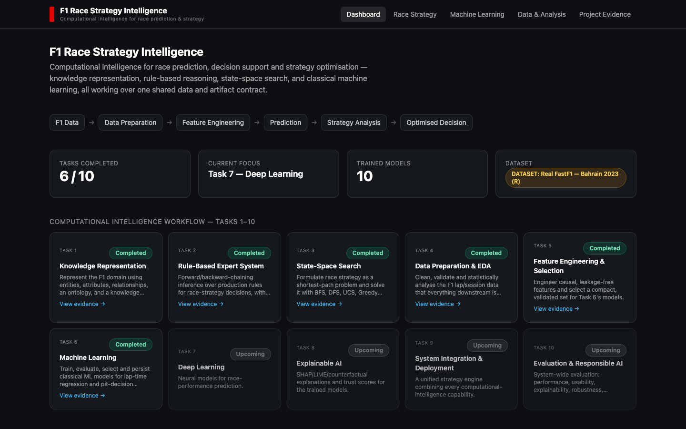
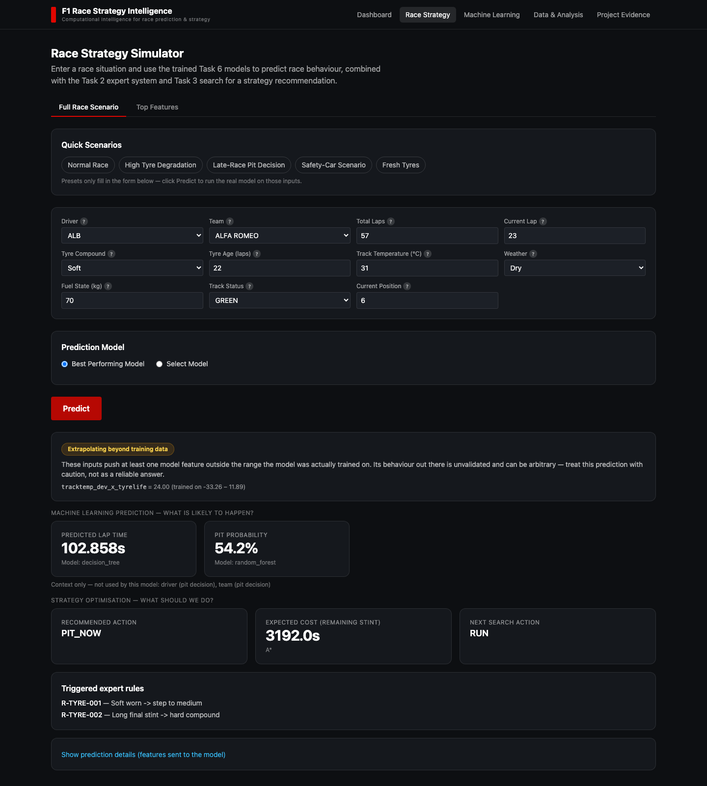
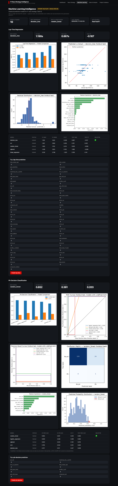
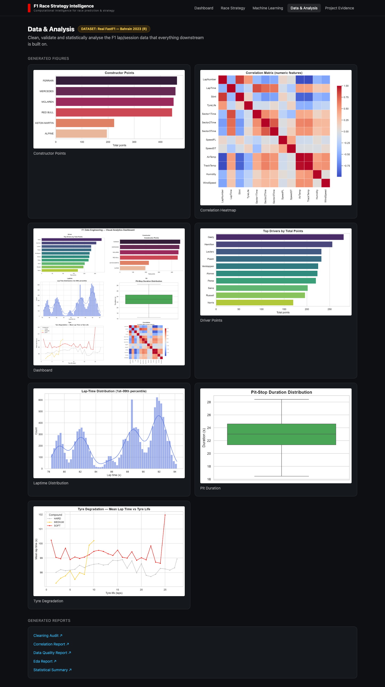

# F1 Race Strategy Intelligence

A full-stack computational-intelligence platform that predicts Formula 1 lap times and pit-stop decisions from real race telemetry, and combines that with rule-based reasoning and search-based optimization to recommend a race strategy — end to end, from raw FastF1 data to a trained model served through a live API and dashboard.


## Screenshots

| Dashboard | Race Strategy Simulator |
|---|---|
|  |  |

| Machine Learning | Data & Analysis |
|---|---|
|  |  |

More in [`docs/screenshots/`](docs/screenshots/), including the [Project Evidence](docs/screenshots/project-evidence.png) page.

## Overview

Formula 1 race strategy is a real sequential decision problem: when should a driver pit, and for which tyre compound, given tyre age, track temperature, fuel load, and the state of the race? This project builds one coherent system around that question, rather than a pile of separate lab exercises:

1. **Fetch real race data** — a genuine FastF1 session (2023 Bahrain Grand Prix), not a toy dataset, via a reproducible synthetic fallback when offline.
2. **Clean and engineer features** — leakage-checked, causally-justified features selected by an automated funnel (variance filtering → correlation pruning → VIF → importance ranking).
3. **Train and compare 10 models** — 5 regression + 5 classification algorithms, evaluated with a time-aware (lap-forward) cross-validation strategy that never trains on the future.
4. **Serve real predictions** — a FastAPI backend that caches trained pipelines and combines the ML output with a rule-based expert system (Task 2) and an A\*/UCS search over pit strategies (Task 3).
5. **Show it, honestly** — a Next.js dashboard where every number, chart, and prediction is read live from a generated artifact or a real model call. Nothing is hard-coded or fabricated; when a model can't answer something, the UI says so.

This started as a 10-part computational-intelligence coursework specification (knowledge representation → expert systems → search → data engineering → feature engineering → ML → deep learning → XAI → integration → evaluation). Tasks 1–6 are implemented as one integrated application; see [Project Status](#project-status) below for what's done vs. planned.

## Features

- **Real ML pipeline, not a demo dataset** — fetches an actual FastF1 Grand Prix session and trains on it; a script exists to swap in any other session (`scripts/fetch_real_session.py`)
- **10 trained models** compared honestly on cross-validated *and* held-out metrics (MAE/RMSE/R² for lap time; ROC-AUC/PR-AUC/F1 for pit decisions), with the winning model per task auto-selected and every model's artifact persisted
- **Time-aware validation** — expanding-window, lap-forward CV; a random shuffle-split would leak future laps into training, so it's never used
- **Data-leakage tests** that fail the build if a target-adjacent column (sector times, speed traps) ever reaches a training matrix
- **Race Strategy Simulator** — real dropdowns sourced from the actual dataset (not free text), server + client-side validation, a model selector, quick scenario presets, and an **out-of-distribution warning** that flags when an input pushes a feature outside the range the model was ever trained on
- **Explainability-lite** — feature importance / coefficients surfaced per model, with human-readable names and descriptions generated from the same metadata the models were trained on
- **Project Evidence page** — every task's real generated reports/figures, scanned live off disk; a task that hasn't been built yet says "Upcoming," never a placeholder
- **One-command setup** — `./run.sh` installs everything, trains if needed, starts both servers, runs three live predictions in your terminal, and opens the browser

## Tech Stack

**Backend:** Python, FastAPI, scikit-learn, XGBoost (optional, gracefully degrades if unavailable), pandas, joblib, pytest, ruff
**Frontend:** Next.js 14 (App Router), TypeScript, Tailwind CSS
**Data:** FastF1 (real telemetry) with a deterministic synthetic fallback; a reproducible feature-engineering notebook (`nbclient`/`nbformat`)
**Tooling:** GitHub Actions CI (lint + test on every push)

## Architecture

```
┌─────────────┐      REST       ┌──────────────┐      cached      ┌───────────────┐
│  Next.js UI │  ───────────►   │  FastAPI     │  ───────────►    │ Trained model │
│ (dashboard, │  ◄───────────   │  backend     │  ◄───────────    │  pipelines    │
│  simulator) │                 └──────┬───────┘                  │  (.joblib)    │
└─────────────┘                        │
                                        ▼
                         Expert System (Task 2) + A* Search (Task 3)
                                        │
                                        ▼
                    data/processed/  (Task 5 feature contract)
                                        ▲
                                        │
                    Task 4 cleaning  ←  FastF1 session data
```

Full technical write-up — module layout, the Task 5 feature contract, leakage prevention, validation strategy, and the real-vs-synthetic data path — is in [`docs/architecture.md`](docs/architecture.md).

## Getting Started

### Prerequisites

- Python 3.10+
- Node.js 18+
- macOS/Linux (uses `lsof`/`nohup`; Windows works via WSL)

### Quickest path

```bash
git clone https://github.com/anjalidmore/f1-quantum-strategy.git
cd f1-quantum-strategy
./run.sh
```

This sets up the Python virtual environment, trains the models if they aren't already (they're checked into the repo, so first run is instant), starts the backend and frontend, runs three real predictions in your terminal, and opens `http://localhost:3000` in your browser.

### Manual setup

```bash
# Backend
python3 -m venv .venv && source .venv/bin/activate
pip install -r requirements.txt
pip install -e .                      # makes `app` importable everywhere
uvicorn app.api.main:app --reload     # http://localhost:8000  (docs at /docs)

# Frontend (separate terminal)
cd frontend
cp .env.example .env.local            # points the UI at the backend above
npm install
npm run dev                           # http://localhost:3000
```

### Rebuilding everything from scratch

```bash
python scripts/build_all.py --force   # Tasks 1-6: knowledge base, expert system,
                                       # search, EDA, and model training, in order
```

### Using real (different) race data instead of the checked-in session

```bash
python scripts/fetch_real_session.py --year 2023 --event Bahrain --session R
python scripts/build_all.py --force
```

See [`docs/architecture.md`](docs/architecture.md#synthetic-vs-real-data) for why this matters and what changes when you do it.

## Testing

```bash
pytest tests/          # 120 tests: data contracts, leakage checks, chronological
                        # splits, model training/persistence, API, and the
                        # original Task 1-4 suites
ruff check app/ scripts/ tests/    # lint
cd frontend && npm run lint && npm run build   # frontend lint + type-check
```

## Project Status

🟡 **Active development** — Tasks 1–6 of a 10-part computational-intelligence roadmap are implemented as one working application.

### Completed
- ✓ Knowledge representation (ontology + knowledge graph)
- ✓ Rule-based expert system (forward/backward chaining, explanations)
- ✓ State-space search (BFS/DFS/UCS/Greedy/A\* strategy optimization)
- ✓ Data preparation & EDA (real + synthetic FastF1 pipelines)
- ✓ Feature engineering & automated feature selection
- ✓ Machine learning (10 models, time-aware validation, persisted pipelines)
- ✓ FastAPI backend with cached model serving
- ✓ Race Strategy Simulator, Machine Learning dashboard, Data & Analysis, and Project Evidence pages

### In Progress
- → Broadening real-data training beyond a single race session

### Planned
- ○ Deep learning models (Task 7)
- ○ SHAP/LIME explainability and trust scores (Task 8)
- ○ Full system integration polish (Task 9)
- ○ Formal responsible-AI evaluation (Task 10)

## Known Limitations

- **Single-session training data.** Models are trained on one real Grand Prix (2023 Bahrain). Results are honest for that race but shouldn't be read as a general-purpose F1 model — see [`docs/architecture.md`](docs/architecture.md#synthetic-vs-real-data).
- **Frontend dependency vulnerabilities.** `npm audit` flags high-severity CVEs in Next.js 14.2.35 and its transitive deps; fixing them requires a major-version bump (Next 14→16) that hasn't been validated against this app yet. Not exploitable in a local/demo context, but worth knowing before deploying this publicly.
- **XGBoost is optional.** If the native OpenMP runtime (`libomp` on macOS) isn't installed, XGBoost is skipped with an explicit status rather than failing — this is by design, not a bug, but it means "10 models" can be 8 on a machine without `libomp`.

## What I Learned

- **A "correct-looking" ML pipeline can still be silently wrong.** The race-strategy simulator's driver/team dropdowns had *zero* effect on real-data predictions for a while — the feature-construction code special-cased two feature names from the synthetic dataset and didn't recognize the real dataset's one-hot driver/team columns, so they always fell back to a training-data median. Fixed by classifying every feature generically against the live contract instead of a fixed name list, and added regression tests that assert changing a dropdown actually changes at least one feature value.
- **A demo preset can quietly ask a model to extrapolate.** A "high tyre degradation" scenario used a hard-coded 48°C track temperature; the real session it was trained on never exceeded 31°C, so the resulting feature value was ~34x outside the model's training range — an arbitrary, meaningless prediction that looked plausible. Fixed by deriving demo presets from the real data's actual range, and by adding a general out-of-range detector that flags any prediction extrapolating beyond training data, surfaced directly in the UI.
- **Time-aware validation isn't optional for panel/time-series data.** A random K-fold here would train on lap 40 and validate on lap 10 — a leak that would make classification metrics look far better than they are. Every model is validated with expanding-window, lap-forward folds instead.

## Future Improvements

- Train across multiple real sessions instead of one, with a proper race/season grouping key
- Add SHAP-based explanations per prediction (Task 8)
- Deploy a live demo (currently local-only)
- Revisit the ~45-feature regression set the automated selection funnel picked for real data — a real overfitting risk on ~800 training rows worth tightening

## License

[MIT](LICENSE)
