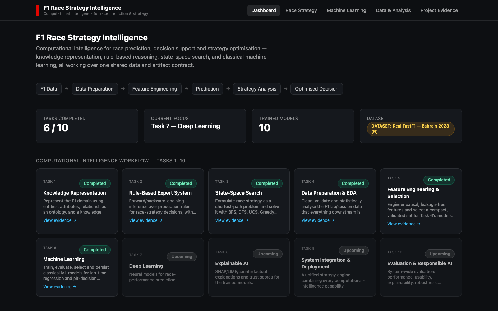
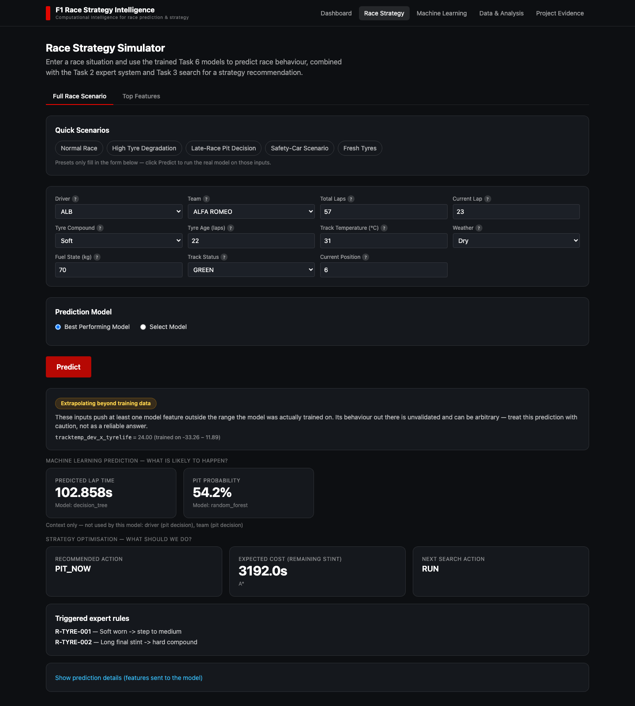
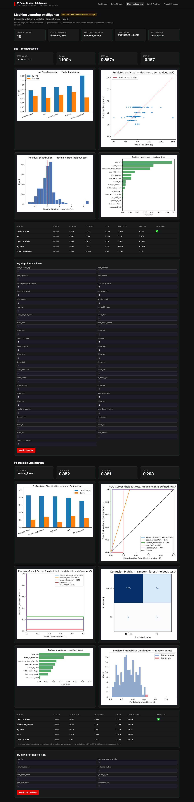
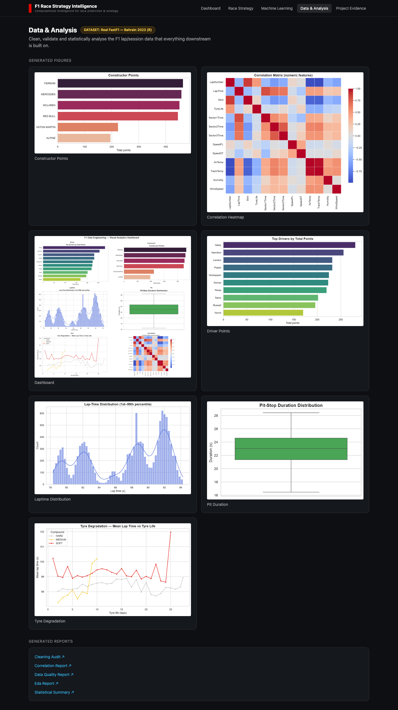

# F1 Race Strategy Intelligence

A full-stack computational-intelligence platform that predicts Formula 1 lap times and pit-stop decisions from real race telemetry, and combines that with rule-based reasoning and search-based optimization to recommend a race strategy — end to end, from raw FastF1 data to a trained model served through a live API and dashboard.


## Screenshots

| Dashboard | Race Strategy Simulator |
|---|---|
|  |  |

| Machine Learning | Data & Analysis |
|---|---|
|  |  |

More in [`docs/screenshots/`](docs/screenshots/), including the [Project Evidence](docs/screenshots/project-evidence.png) page.

## Overview

Formula 1 race strategy is a real sequential decision problem: when should a driver pit, and for which tyre compound, given tyre age, track temperature, fuel load, and the state of the race? This project builds one coherent system around that question, rather than a pile of separate lab exercises:

1. **Fetch real race data** — a genuine FastF1 session (2023 Bahrain Grand Prix), not a toy dataset, via a reproducible synthetic fallback when offline.
2. **Clean and engineer features** — leakage-checked, causally-justified features selected by an automated funnel (variance filtering → correlation pruning → VIF → importance ranking).
3. **Train and compare 10 models** — 5 regression + 5 classification algorithms, evaluated with a time-aware (lap-forward) cross-validation strategy that never trains on the future, then **two Keras deep networks** on the identical folds so the comparison is like-for-like.
4. **Serve real predictions** — a FastAPI backend that caches trained pipelines and combines the ML output with a rule-based expert system (Task 2) and an A\*/UCS search over pit strategies (Task 3).
5. **Explain every prediction** — SHAP attributions, LIME surrogates, counterfactuals and a trust score, so a race engineer sees *why* a call was made and how much to believe it.
6. **Show it, honestly** — a Next.js dashboard where every number, chart, and prediction is read live from a generated artifact or a real model call. Nothing is hard-coded or fabricated; when a model can't answer something, the UI says so.

This started as a 10-part computational-intelligence coursework specification (knowledge representation → expert systems → search → data engineering → feature engineering → ML → deep learning → XAI → integration → evaluation). Tasks 1–6 are implemented as one integrated application; see [Project Status](#project-status) below for what's done vs. planned.

## Features

- **Real ML pipeline, not a demo dataset** — fetches an actual FastF1 Grand Prix session and trains on it; a script exists to swap in any other session (`scripts/fetch_real_session.py`)
- **10 trained models** compared honestly on cross-validated *and* held-out metrics (MAE/RMSE/R² for lap time; ROC-AUC/PR-AUC/F1 for pit decisions), with the winning model per task auto-selected and every model's artifact persisted
- **Time-aware validation** — expanding-window, lap-forward CV; a random shuffle-split would leak future laps into training, so it's never used
- **Data-leakage tests** that fail the build if a target-adjacent column (sector times, speed traps) ever reaches a training matrix
- **Race Strategy Simulator** — real dropdowns sourced from the actual dataset (not free text), server + client-side validation, a model selector, quick scenario presets, and an **out-of-distribution warning** that flags when an input pushes a feature outside the range the model was ever trained on
- **Explainability-lite** — feature importance / coefficients surfaced per model, with human-readable names and descriptions generated from the same metadata the models were trained on
- **Project Evidence page** — every task's real generated reports/figures, scanned live off disk; a task that hasn't been built yet says "Upcoming," never a placeholder
- **One-command setup** — `./run.sh` installs everything, trains if needed, starts both servers, runs three live predictions in your terminal, and opens the browser

## Tech Stack

**Backend:** Python, FastAPI, scikit-learn, XGBoost (optional, gracefully degrades if unavailable), pandas, joblib, pytest, ruff
**Frontend:** Next.js 14 (App Router), TypeScript, Tailwind CSS
**Data:** FastF1 (real telemetry) with a deterministic synthetic fallback; a reproducible feature-engineering notebook (`nbclient`/`nbformat`)
**Tooling:** GitHub Actions CI (lint + test on every push)

## Architecture

```
┌─────────────┐      REST       ┌──────────────┐      cached      ┌───────────────┐
│  Next.js UI │  ───────────►   │  FastAPI     │  ───────────►    │ Trained model │
│ (dashboard, │  ◄───────────   │  backend     │  ◄───────────    │  pipelines    │
│  simulator) │                 └──────┬───────┘                  │  (.joblib)    │
└─────────────┘                        │
                                        ▼
                         Expert System (Task 2) + A* Search (Task 3)
                                        │
                                        ▼
                    data/processed/  (Task 5 feature contract)
                                        ▲
                                        │
                    Task 4 cleaning  ←  FastF1 session data
```

Full technical write-up — module layout, the Task 5 feature contract, leakage prevention, validation strategy, and the real-vs-synthetic data path — is in [`docs/architecture.md`](docs/architecture.md). End-to-end data flow, with each stage marked real or stub, is in the same document's [End-to-end flow](docs/architecture.md#end-to-end-flow) section.

### "Nothing is hard-coded" — verified, not asserted

That claim was tested adversarially rather than taken on trust:

```
API /api/ml/metrics  →  artifacts/metrics/regression_metrics.json
   decision_tree   API=0.8673476599610876   DISK=0.8673476599610876   ✓

MUTATION TEST
   set the on-disk MAE to 999.123456  →  the API returned 999.123456
   ⇒ reads from the artifact, not a constant
```

A matching value proves nothing on its own — a constant could coincide. Changing the artifact and watching the API follow is what proves the read path is real. A full `python scripts/build_all.py --force` rebuild also reproduced every committed artifact: entity counts (61/29), rule count (32) and search costs (2262.42 s) identical, ML metrics agreeing to ~1e-14.

## Getting Started

### Prerequisites

- Python 3.10+
- Node.js 18+
- macOS/Linux (uses `lsof`/`nohup`; Windows works via WSL)

### Quickest path

```bash
git clone https://github.com/anjalidmore/f1-quantum-strategy.git
cd f1-quantum-strategy
./run.sh
```

This sets up the Python virtual environment, trains the models if they aren't already (they're checked into the repo, so first run is instant), starts the backend and frontend, runs three real predictions in your terminal, and opens `http://localhost:3000` in your browser.

### Manual setup

```bash
# Backend
python3 -m venv .venv && source .venv/bin/activate
pip install -r requirements.txt
pip install -e .                      # makes `app` importable everywhere
uvicorn app.api.main:app --reload     # http://localhost:8000  (docs at /docs)

# Frontend (separate terminal)
cd frontend
cp .env.example .env.local            # points the UI at the backend above
npm install
npm run dev                           # http://localhost:3000
```

### Rebuilding everything from scratch

```bash
python scripts/build_all.py --force   # Tasks 1-6: knowledge base, expert system,
                                       # search, EDA, and model training, in order
```

### Using real (different) race data instead of the checked-in session

```bash
python scripts/fetch_real_session.py --year 2023 --event Bahrain --session R
python scripts/build_all.py --force
```

See [`docs/architecture.md`](docs/architecture.md#synthetic-vs-real-data) for why this matters and what changes when you do it.

## Testing

```bash
pytest tests/          # data contracts, leakage checks, chronological splits,
                        # model training/persistence, deep learning, explainability,
                        # API, and the original Task 1-4 suites
ruff check app/ scripts/ tests/    # lint
cd frontend && npm run lint && npm run build   # frontend lint + type-check
```

# Task 7 — Deep Learning Model Development

### Objective

Design, train, validate and evaluate deep neural networks for the platform's two existing race-strategy
prediction problems, and test — rather than assume — whether they improve on Task 6's classical models on
the same data and the same held-out laps.

### F1 Dataset

The real Task 5 feature matrix, `data/processed/f1_features_selected.csv`: the **2023 Bahrain Grand Prix
race (FastF1 telemetry)** — 995 driver-laps (laps 4–57 after Task 5's warm-up drop), 20 drivers, 10 teams.
No synthetic data. 0 missing values in any column the models use (the Task 5 contract is validated before
training, and fails the run on missing values or leakage columns). Task 5's leakage exclusions stay excluded:
sector times (they sum to lap time), speed traps and `IsPersonalBest`.

### Prediction Target

Both targets Task 6 already implements, so the comparison is like-for-like:

| Target | Task | Distribution |
|---|---|---|
| `target_laptime` | regression — lap time in seconds | mean 99.10 s, sd 2.01 s, range 94.00–103.99 s |
| `target_pit_next_lap` | binary — does the driver pit at the end of this lap? | **48 of 995 laps (4.82%)** — heavily imbalanced |

The upper end of the lap-time range is Task 4's IQR outlier cap: 79 laps (60 of them in- or out-laps around
pit stops) are recorded at exactly 103.985 s.

**Known label gap.** FastF1 gives no `Stint` for NOR, and Task 4's median imputation
(`app/intelligence/data/pipeline.py`) fills all 18 of NOR's laps with 4.5. The pit label is derived from stint
changes, so NOR's real stop at the end of lap 47 (HARD → SOFT, tyre age 10 → 5) is labelled "no pit". Tasks 1–6
are left unchanged, so every pit metric below uses the labels as they stand.

### Feature Engineering

None added. Task 7 consumes Task 5's selected features unchanged:

- **Lap time — 45 inputs**: 17 race-state features (`tyre_life`, `field_median_lag1`, `gap_roll3_mean`,
  `form_vs_baseline`, `track_status`, weather, compound indicators and tyre-age interactions, …) and
  28 driver/team one-hot indicators.
- **Pit decision — 8 inputs**: `tyre_life`, `tracktemp_dev_x_tyrelife`, `form_vs_baseline`, `field_median_lag1`,
  `field_pace_trend`, `tyrelife_x_soft`, `gap_roll3_mean`, `compound_soft`.

Preprocessing: `StandardScaler` fitted on the **training laps only** (binary indicators left unscaled); the
lap-time target is also standardised on the training laps, and every prediction is converted back to seconds
before any metric is computed.

### DNN Architecture

Keras 3 (PyTorch backend — TensorFlow has no wheel for this project's Python 3.14).

| Lap-time network (45 → 1) | Units | Activation | Dropout |
|---|---:|---|---:|
| hidden_1 | 128 | ReLU | 0.2 |
| hidden_2 | 64 | ReLU | 0.2 |
| hidden_3 | 32 | ReLU | 0.2 |
| output | 1 | linear | — |

**16,257 parameters (all trainable)** · loss MSE · RMSprop · L2 0.001.

| Pit-decision network (8 → 1) | Units | Activation | Dropout |
|---|---:|---|---:|
| hidden_1 | 16 | ReLU | 0.3 |
| hidden_2 | 8 | ReLU | 0.3 |
| output | 1 | sigmoid | — |

**289 parameters (all trainable)** · loss binary cross-entropy · RMSprop · L2 0.0001.

The specification's suggested 128-64-32 network was the *starting point* for both. It validated best for lap
time and was replaced for the pit decision: with 8 inputs and 41 positive training laps, the 16-8 network
scored higher cross-validated PR-AUC than both larger options.

### Hyperparameters

One factor at a time over the specification's candidate values — architecture (3 options), learning rate
(0.001 / 0.0005 / 0.0001), batch size (16 / 32 / 64), dropout (0.2–0.5), optimizer (Adam / RMSprop), L2
(0.0001 / 0.001), plus MSE-vs-Huber for lap time and class weighting for the pit decision. Each stage varies one
setting while the others hold the best value so far: **13 configurations per target**, every one scored on the
same four time-aware folds and recorded in
[`artifacts/deep_learning/hyperparameter_report.csv`](artifacts/deep_learning/hyperparameter_report.csv).
Selection metric: mean CV **MAE** (lap time) and mean CV **PR-AUC** (pit decision — ROC-AUC stays flattering
at a 4.8% positive rate). The test laps were never consulted.

| | Selected | Selection metric (4-fold CV) |
|---|---|---:|
| Lap time | 128-64-32, lr 0.001, batch 16, dropout 0.2, RMSprop, L2 0.001, MSE | CV MAE **0.953 s** ± 0.422 |
| Pit decision | 16-8, lr 0.001, batch 32, dropout 0.3, RMSprop, L2 0.0001, **no class weighting** | CV PR-AUC **0.482** ± 0.115 |

Class weighting was investigated, not assumed: on the same folds the unweighted network scored CV PR-AUC
0.421 against 0.361 with balanced weights, so weighting was not adopted. Many neighbouring configurations
differ by less than their fold-to-fold spread (the ± column), so small gaps between them should not be read as
real differences.

### Training

`EarlyStopping(monitor="val_loss", patience=25, restore_best_weights=True)`, maximum 300 epochs, seed 42.
Both final networks ran 35 epochs and restored **epoch 10**, where validation loss was lowest.

### Time-Aware Validation

The existing chronological mechanism (`app/intelligence/ml/splits.py`) is reused, so no model is ever scored on
laps earlier than the ones it learned from:

| Role | Laps | Rows |
|---|---|---:|
| Hyperparameter selection | 4 expanding-window folds over laps 4–46 (each validates on the laps after its training laps) | 815 |
| Final training | laps 4–38 | 675 |
| Early stopping (validation) | laps 39–46 | 140 |
| **Test — used once** | **laps 47–57** | **180** |

### Overfitting Prevention

Dropout on every hidden layer, L2 weight decay, early stopping with best-weight restoration, network size chosen
on validation data, and strictly time-ordered splits. What the curves
([`loss_curve.png`](artifacts/deep_learning/laptime/loss_curve.png),
[`accuracy_curve.png`](artifacts/deep_learning/pit_decision/accuracy_curve.png)) actually show:

- **Lap time — overfitting, contained but real.** Validation loss reached its minimum at epoch 10 and rose 41%
  afterwards while training loss kept falling — the curves diverge, and early stopping discarded those epochs.
  The saved model still has a large gap: training MAE 0.52 s (R² 0.78) against validation MAE 1.50 s
  (R² 0.25). Part of that gap is the validation block itself: the same network scores MAE 0.57 s (R² 0.46) on
  the later test laps, so laps 39–46 are unusually hard, not only unseen.
- **Pit decision — reasonable fit.** Validation loss bottomed at epoch 10 and drifted up 30% afterwards; the
  restored weights show no train/validation gap in PR-AUC. The accuracy curve is flat at 0.957 from epoch 5 —
  exactly the "always stay out" rate on those 140 laps. At the default 0.5 threshold this network never
  predicts a pit stop, which is why decisions use a tuned threshold and selection uses PR-AUC.

### Evaluation

Held-out chronological test laps (47–57), evaluated once.

**Lap time**

| Split | MAE (s) | RMSE (s) | R² |
|---|---:|---:|---:|
| Train (laps 4–38) | 0.522 | 0.864 | 0.782 |
| Validation (laps 39–46) | 1.500 | 2.375 | 0.248 |
| **Test (laps 47–57)** | **0.565** | **0.908** | **0.456** |

**Pit decision** — decision threshold **0.1524**, tuned on 635 out-of-fold predictions (36 pit laps), where it
raised F1 from 0.000 at 0.5 to 0.458.

| Split | Pit laps | Accuracy | Precision | Recall | F1 | ROC-AUC | PR-AUC |
|---|---:|---:|---:|---:|---:|---:|---:|
| Train | 41/675 | 0.837 | 0.152 | 0.366 | 0.214 | 0.680 | 0.184 |
| Validation | 6/140 | 0.964 | 1.000 | 0.167 | 0.286 | 0.968 | 0.606 |
| **Test** | **1/180** | **0.994** | **0.000** | **0.000** | **0.000** | **0.777** | **0.024** |

Confusion matrix on the test laps: 179 true "stay out", 0 false alarms, **1 missed pit stop**, 0 caught.
With a single pit event in the test laps these precision / recall / F1 figures are dominated by chance — they
are reported, not interpreted. The cross-validated figures, over 36 pit laps, are the better evidence.
Plots: [`confusion_matrix.png`](artifacts/deep_learning/pit_decision/confusion_matrix.png),
[`roc_curve.png`](artifacts/deep_learning/pit_decision/roc_curve.png),
[`prediction_vs_actual.png`](artifacts/deep_learning/laptime/prediction_vs_actual.png).

### Comparison with Existing ML Model

Task 6's own committed results, on **the same test laps** ([`model_comparison.csv`](artifacts/deep_learning/model_comparison.csv)):

| Lap time | MAE (s) | RMSE (s) | R² |
|---|---:|---:|---:|
| **Task 7 DNN** | **0.565** | **0.908** | **0.456** |
| Task 6 SVR (Task 6's selected model) | 0.782 | 1.029 | 0.302 |
| Task 6 linear regression | 0.790 | 1.141 | 0.142 |
| Task 6 decision tree | 0.867 | 1.331 | −0.167 |
| Task 6 random forest | 0.925 | 1.267 | −0.058 |
| Task 6 XGBoost | 1.086 | 1.441 | −0.369 |

| Pit decision | Precision | Recall | F1 | ROC-AUC | PR-AUC |
|---|---:|---:|---:|---:|---:|
| Task 7 DNN | 0.000 | 0.000 | 0.000 | 0.777 | 0.024 |
| Task 6 random forest (Task 6's selected model) | 0.044 | 1.000 | 0.083 | 0.983 | 0.250 |

On the **same four cross-validation folds** — a comparison resting on 36 pit laps rather than one:

| | Task 7 DNN | Best Task 6 model |
|---|---:|---:|
| Lap time, CV MAE (s) | **0.953** ± 0.422 | 1.190 ± 0.540 (decision tree) |
| Pit decision, CV PR-AUC | **0.482** ± 0.115 | 0.386 ± 0.125 (random forest) |

### Results

- **Lap time: the DNN is the best model in the project**, on both the cross-validation folds and the test laps
  (MAE 0.565 s vs 0.782 s; R² 0.456 vs 0.302 for Task 6's selected model).
- **Pit decision: inconclusive.** Cross-validated PR-AUC favours the DNN (0.482 vs 0.386), but the fold spreads
  overlap. On the test laps, the one real pit stop was caught by Task 6's random forest and missed by the DNN.
  One event cannot decide between the models; more races can.
- Three defects in the earlier Task 7 code were found and fixed during this work, and each is covered by a
  regression test in `tests/test_task7_task8_fixes.py`:
  1. `model.fit(class_weight=...)` did not weight the loss on this Keras/PyTorch installation (measured: a
     class-weighted fit left predictions essentially unchanged). Class weighting now happens inside the loss.
  2. The final network early-stopped on rows that were also in its training set. It now trains on laps 4–38
     and validates on the later laps 39–46.
  3. `/api/dl/predict/pit` decided at 0.5 rather than at the tuned threshold.

### Saved Artifacts

| File | Contents |
|---|---|
| `artifacts/models/deep_learning/{laptime,pit_decision}/f1_dnn_model.h5` | trained networks (HDF5); reloaded after saving and verified to reproduce the predictions |
| `artifacts/models/deep_learning/*/feature_scaler.joblib`, `target_scaler.joblib`, `model_spec.json` | fitted scalers, feature order, load instructions |
| `artifacts/deep_learning/hyperparameter_report.csv` / `.md` | every experiment |
| `artifacts/deep_learning/{laptime,pit_decision}/training_history.csv` | per-epoch loss and metric |
| `artifacts/deep_learning/*/loss_curve.png`, `accuracy_curve.png`, `mae_curve.png` | training curves |
| `artifacts/deep_learning/pit_decision/confusion_matrix.png`, `roc_curve.png`; `laptime/prediction_vs_actual.png` | evaluation plots |
| `artifacts/deep_learning/evaluation_report.json` / `.md` | train / validation / test metrics and overfitting diagnosis |
| `artifacts/deep_learning/model_comparison.csv` / `.json`, `*/model_comparison.png` | DNN vs Task 6 |
| `artifacts/deep_learning/model_metadata.json` | architecture, hyperparameters, preprocessing, split, threshold |

Model weights live in the private `models/` tree and are **not** served by the API.

### How to Run

```bash
source .venv/bin/activate
python scripts/build_all.py --force   # Tasks 1–8; Task 7 alone takes ~10 minutes on a laptop CPU
# or just Task 7:
python -c "import logging; logging.basicConfig(level=logging.INFO); \
from app.intelligence.dl import pipeline; pipeline.train_all()"
```

Reload a saved network:

```python
import keras, joblib
model  = keras.saving.load_model("artifacts/models/deep_learning/laptime/f1_dnn_model.h5", compile=False)
scaler = joblib.load("artifacts/models/deep_learning/laptime/feature_scaler.joblib")
```

Results are served at `GET /api/dl/{models,metrics,comparison,history,artifacts}` and shown on the dashboard's
**Deep Learning** page.

---

# Task 8 — Explainable Artificial Intelligence (XAI)

### Objective

Explain *why* the platform's race-strategy predictions come out the way they do. Say how far each explanation
can be trusted. Show which laps, drivers, teams and compounds the model handles well or badly, all without
inventing anything the data does not contain.

### Model Explained

Task 8 uses the trained Task 7 DNN as the model being explained:
`artifacts/models/deep_learning/{laptime,pit_decision}/f1_dnn_model.h5`, reloaded from disk, never
retrained. Task 6's selected classical model (SVR for lap time, random forest for the pit decision) is used
only as a second opinion: for the trust score's model-agreement component and for an importance comparison.

### Prediction Task

The same two targets, explained on the same **180 chronological test laps (laps 47–57)** of the
2023 Bahrain Grand Prix:

- `target_laptime`: predicted lap time in seconds (45 inputs).
- `target_pit_next_lap`: probability that the driver pits at the end of this lap (8 inputs), turned into a
  pit / stay-out call at the tuned threshold **0.1524** that Task 7 chose on cross-validation laps.

Scenarios are picked from the test laps by rule, not by hand, and only if the data contains them:

| Target | Scenario | Lap |
|---|---|---|
| Lap time | fastest predicted | GAS lap 47, SOFT, tyre age 7 |
| | median predicted | ALB lap 53, SOFT, tyre age 13 |
| | slowest predicted (also the freshest tyres, just after a stop) | ZHO lap 55, SOFT, tyre age 4 |
| | fresh-tyre (freshest lap not already shown) | NOR lap 48, SOFT, tyre age 5 |
| | old-tyre | DEV lap 56, HARD, tyre age 27.5 |
| Pit decision | non-pit (lowest P(pit)) | NOR lap 51, P = 0.0025 |
| | pit-window (closest to the threshold; also the highest P(pit) on any test lap) | ZHO lap 48, tyre age 19, P = 0.1287 |
| | **the one lap where a driver actually pitted** | ZHO lap 54, SOFT, tyre age 25, P = 0.0630 |

### Feature Importance

Permutation importance on the test laps, scored as the rise in MAE (lap time) or the fall in ROC-AUC (pit
decision) when one column is shuffled, 10 repeats. Output: `artifacts/xai/feature_importance.png` and `.csv`.

| Rank | Lap time (DNN) | Pit decision (DNN) |
|---:|---|---|
| 1 | `tyre_life` (+0.160 s MAE) | `tyre_life` (−0.245 ROC-AUC) |
| 2 | `tracktemp_dev_x_tyrelife` (+0.140) | `tyrelife_x_soft` (−0.190) |
| 3 | `form_vs_baseline` (+0.111) | `tracktemp_dev_x_tyrelife` (−0.162) |

For lap time, the DNN and Task 6's SVR rank the same top three features in the same order. For the pit
decision they diverge: the random forest ranks `tyre_life` 8th and `form_vs_baseline` 2nd
(`importance/*_importance_comparison.png`).

### SHAP Analysis

`KernelExplainer` on the DNN (model-agnostic: TreeExplainer does not apply to a neural network), 200 samples
per row over a 25-point k-means background, for all 180 test laps. These Shapley values are **sampled
approximations**: ranks and signs are meaningful, while magnitudes carry sampling noise.

- **Global** (`shap/*_shap_summary.png`, `*_shap_importance.png`). Lap time: `field_median_lag1`
  (mean |SHAP| 0.727 s), `tracktemp_dev_x_tyrelife` (0.688 s), `stint_number` (0.456 s), `tyre_life`,
  `form_vs_baseline`. Pit decision: `tracktemp_dev_x_tyrelife` (0.071), `tyre_life` (0.045),
  `tyrelife_x_soft` (0.019).
- **Local** (`shap/*_waterfall.png`, one per scenario). All 180 laps' values are in `*_shap_values.csv`.
  The dashboard's lap inspector checks additivity: base value + Σ SHAP = the model's prediction.
- **Driver/team identity.** 28 of the lap-time model's 45 inputs are driver/team one-hots, but they carry
  **3.8%** of total |SHAP|, against 62.2% if attribution were spread evenly. The highest-ranked one,
  `team_red_bull_racing`, is 11th. The pit model has no identity inputs.

Full report: `artifacts/xai/SHAP_Report.md`.

### LIME Analysis

`LimeTabularExplainer`: 2,000 perturbations per scenario and a local linear surrogate. Output:
`artifacts/xai/lime/*_lime.png`, `lime/lime_explanations.csv`, `LIME_Report.md`.

Compared with SHAP (descriptive, via the top-3 overlap, Jaccard):

| | Mean SHAP–LIME top-3 overlap (180 laps) | Scenario range | LIME surrogate local R² |
|---|---:|---:|---:|
| Lap time | 0.298 | 0.2–0.5 | 0.29–0.44 |
| Pit decision | 0.550 | 0.2–1.0 | 0.19–0.44 |

- **LIME's top lap-time factor is a feature that never varies on these laps.** LIME ranks `track_status`
  first on **all 180** test laps, yet `track_status` is 1 (green flag) on every one of them. It varies only in
  training (safety-car and yellow-flag codes), so LIME's perturbations imagine flags that did not happen. SHAP,
  which explains against a background drawn from the data, never ranks it in the top three. On these laps,
  SHAP describes what drove the prediction, while LIME describes what *would* move it under different
  track conditions.
- With a local R² of 0.19–0.44, the linear surrogates explain less than half of the DNN's behaviour even
  near each lap. Treat LIME weights as indicative.

### Counterfactual Analysis

The counterfactual question is: *what tyre age would change this call?* The scan varies **tyre age only**,
across the range seen in training (1–22 laps), in 0.5-lap steps. To keep every counterfactual row physically
possible, the scan:

- **recomputes** the derived features from the new tyre age (`tyrelife_x_soft`, `tyrelife_x_medium`,
  `tracktemp_dev_x_tyrelife`). The identities were verified on all 995 real laps;
- **holds fixed** compound, tyre-set freshness, track-temperature deviation and pace features. Changing tyre
  age cannot change the compound.

Output: `artifacts/xai/counterfactual_analysis.csv` (20 rows), `counterfactual/*_tyre_age.png`,
`Counterfactual_Report.md`.

- **Pit decision: no tyre age in 1–22 flips any of the three calls.** The pit-window lap (ZHO lap 48) peaks at
  P = 0.1364 at tyre age 16.5, just short of the 0.1524 threshold. The actual pit lap has tyre age 25, which
  is **outside the training range**, so the model is extrapolating there. The report says so rather than
  scanning beyond the data.
- **Lap time: effects are small except on fresh tyres.** For typical laps, ±5 laps of tyre age moves the
  prediction by less than 0.1 s. On the two freshest-tyre laps, the DNN predicts that *older* tyres are
  **faster**, by 1.29 s at +5 laps for ZHO lap 55. That is not how tyres behave. It reflects the out-lap
  effect: in the training data, low tyre age coincides with slow laps just after a stop. The old-tyre lap
  (27.5 laps) is outside the range, so no what-if is reported for it.
- DiCE (random search) runs as a supplementary, unconstrained check on the pit-window lap. It flips the call
  by changing one feature (e.g. `tracktemp_dev_x_tyrelife` from −17.3 to 0.7). Those alternatives are **not**
  guaranteed to be physically consistent, which is why the tyre-age scan is the primary method.

### Trust Score

A **project-defined** score, not a validated or standardised measure. Its weights are a judgement, not a fit.

```
trust = Σ wₖ·componentₖ / Σ wₖ   over the components that apply
  confidence            0.35  distance of P(pit) from the tuned threshold (0 at the threshold, 1 at certainty)
  model_agreement       0.25  1 − |DNN − Task 6| (probability, or scaled by the lap-time SD)
  explanation_stability 0.20  Jaccard overlap of the SHAP and LIME top-3 features
  input_validity        0.20  share of inputs inside the training 1st–99th percentile
bands: HIGH ≥ 0.75 · MODERATE ≥ 0.50 · LOW ≥ 0.25 · DO NOT ACT < 0.25
```

Lap time has no decision threshold, so `confidence` does not apply there and the other weights are
renormalised. A missing component is never scored as zero. Output: `artifacts/xai/trust_score_report.csv`
(all 180 laps × 2 targets, every component shown), `Trust_Score_Report.md`.

| | Mean | HIGH | MODERATE | LOW | DO NOT ACT |
|---|---:|---:|---:|---:|---:|
| Lap time (180 laps) | 0.632 | 13 | 140 | 27 | 0 |
| Pit decision (180 laps) | 0.712 | 55 | 122 | 3 | 0 |

**Checked against outcomes, the score does not track lap-time error.** The Spearman correlation between
trust and absolute error is −0.09 (p = 0.24), and mean error is 0.61 s (HIGH), 0.55 s (MODERATE) and
0.61 s (LOW). The only missed pit call, the actual pit lap, scored **MODERATE (0.551)**, with its lowest
components in input validity (0.625) and model agreement (0.484), because Task 6 gave P = 0.579. Use the
score to see *which* component is weak; do not read it as a calibrated probability of being right.

### F1-Specific Performance Stratification

This section measures how the model's errors differ across **drivers, teams and tyre compounds**. The
dataset has no demographic or protected attributes, and none are invented. There is one circuit, so there is
no circuit stratum. Groups with fewer than 30 laps, or fewer than 5 pit laps, are flagged as descriptive
only. Output: `artifacts/xai/fairness_assessment.csv` (62 rows), `stratification/*.png`,
`Fairness_Report.md`.

- **Lap time, by compound:** HARD 99 laps, MAE 0.388 s (bias +0.10 s); **SOFT 81 laps, MAE 0.782 s**
  (bias −0.39 s, predicting too fast). Both groups are adequately sized.
- **By driver and team** (9–22 laps each, all flagged small): driver MAE ranges from 0.235 s (ALB) to
  **2.316 s (NOR)** and 1.417 s (ZHO). Both of the worst drivers include a lap straight after a stop whose
  recorded time sits at the 103.985 s cap that Task 4's outlier step applies (79 laps in the dataset are at that
  cap). NOR's lap 48 also follows a stop that the data does not label (see Limitations). The spread reflects
  pit-stop laps, not the driver.
- **Pit decision:** the test laps contain **one** pit stop, so recall and false-negative rate are 0/1 and
  1/1. That is one event, not a rate. Every group is flagged insufficient. The measurable difference is that
  mean P(pit) is 0.059 on SOFT laps and 0.035 on HARD laps.

### Explainability Dashboard

The dashboard's **Explainability** page (`frontend/app/explainability/page.tsx`) reads only from
`artifacts/xai/` through the API:

- global importance, SHAP summary and stratification figures;
- a card per scenario with the plain-English narrative, SHAP vs LIME factors, every trust component and the
  counterfactual sentence;
- a **lap inspector**: pick any of the 180 test laps for either target to see its prediction, SHAP bars,
  trust components, race state and a live tyre-age counterfactual.

API: `GET /api/xai/{summary,feature-importance,shap,lime,counterfactual,trust-score,fairness,explanation,stratification}`,
`GET /api/xai/laps?target=…`, `GET /api/xai/lap?target=…&row_index=…`.

Example explanation text, generated from the SHAP values for the actual pit lap:

> Recommend STAYING OUT - model confidence 6%. Track temperature acting on tyre age (-27.73) is a major factor
> pushing against stopping; tyre age (25) is a major factor pushing towards a stop; tyre age on the soft
> compound (25) is a minor factor pushing towards a stop. Trust in this recommendation: MODERATE.

### Results

- **The model runs mainly on race state.** Tyre age and its interaction with track temperature lead both
  targets. Driver/team identity carries 3.8% of lap-time attribution, against 62.2% if spread evenly.
- **Why the real pit stop was missed.** On ZHO lap 54, the tyres were 25 laps old, beyond the 1–22 lap
  range seen in training, and the track-temperature deviation was −1.11 °C. The track-temperature × tyre-age
  term (SHAP −0.049) cancelled tyre age (+0.046) and the soft-tyre term (+0.015). The prediction ended at
  0.063, *below* the 0.076 base rate. Task 6's random forest gave 0.579; trees stay flat beyond the training
  range instead of extrapolating a trend.
- **One non-physical behaviour, found by the counterfactual scan:** on laps just after a stop, the lap-time
  DNN predicts that older tyres are faster. This is a confound with out-laps, not tyre physics.
- **SHAP and LIME often disagree** on the lap-time model (mean top-3 overlap 0.30), largely because of LIME's
  `track_status` artefact.
- **The trust score is transparent, but on these laps it does not predict error.**

### Limitations

- **One race, 180 test laps, one labelled pit stop.** Every pit-decision result is illustrative, not statistical.
  There is a second, **unlabelled** stop: NOR's at the end of lap 47. Task 4 imputed NOR's missing `Stint` as 4.5,
  so no stint change was recorded. Both models rank that lap low (DNN 172nd of 180 by P(pit), Task 6 150th), so
  the label gap does not change the conclusions above. Fixing it belongs in Task 4.
- Permutation importance for the pit decision is scored on ROC-AUC. With one positive test lap, that means
  how well that single lap is ranked, so the pit-importance values are noisy.
- SHAP values are sampled approximations (KernelExplainer, 200 samples), not exact.
- LIME surrogates fit poorly (local R² ≤ 0.44), and LIME is not run in the live API path (the trust score
  renormalises there instead).
- The counterfactual scan varies tyre age alone. Real alternatives (a different compound, a different stop
  lap) change several inputs together, and the scan cannot answer questions outside the 1–22 lap range.
- The trust score is a project-defined heuristic, unvalidated against race engineers and uncorrelated with
  error on this holdout.
- Stratification groups are 9–22 laps. Driver and team differences are descriptive.

### How to Run

```bash
source .venv/bin/activate
python scripts/build_all.py            # builds whatever is missing; Task 8 needs Task 7's models
python scripts/build_all.py --force    # rebuild everything, Tasks 1–8
# or just Task 8 (about 2 minutes on a laptop CPU):
python -c "import logging; logging.basicConfig(level=logging.INFO); \
from app.intelligence.xai import pipeline; pipeline.run_all()"
```

Everything is written under `artifacts/xai/`: `shap/`, `lime/`, `counterfactual/`, `importance/`,
`stratification/`, the CSVs listed above, six Markdown reports and `xai_metadata.json`. View the results on
the dashboard's **Explainability** page.

---

## Project Status

🟡 **Active development** — Tasks 1–6 of a 10-part computational-intelligence roadmap are implemented as one working application.

### Completed
- ✓ Knowledge representation (ontology + knowledge graph)
- ✓ Rule-based expert system (forward/backward chaining, explanations)
- ✓ State-space search (BFS/DFS/UCS/Greedy/A\* strategy optimization)
- ✓ Data preparation & EDA (real + synthetic FastF1 pipelines)
- ✓ Feature engineering & automated feature selection
- ✓ Machine learning (10 models, time-aware validation, persisted pipelines)
- ✓ **Deep learning (Task 7)** — Keras MLPs per target, tuned on the same folds and compared against the classical models on the identical holdout
- ✓ **Explainable AI (Task 8)** — SHAP, LIME, physically consistent tyre-age counterfactuals, a project-defined trust score, and F1-specific performance stratification by driver, team and compound
- ✓ FastAPI backend with cached model serving
- ✓ Race Strategy Simulator, Machine Learning, Deep Learning, Explainability, Data & Analysis, and Project Evidence pages

### In Progress
- → Broadening real-data training beyond a single race session

### Planned
- ○ Full system integration polish (Task 9)
- ○ Formal responsible-AI evaluation (Task 10)

## Known Limitations

- **The pit-decision classifier is not usable as a decision rule yet.** Pit events are only 4.8% of laps (48 of 995), and the chronological test laps contain a single labelled stop. Task 6's random forest scores test ROC-AUC 0.98, which flatters at that prevalence: PR-AUC is 0.25 and, at its tuned threshold of 0.48, precision is 0.043 (recall 1.0 on that one stop, F1 0.083). The Task 7 network, at its tuned threshold, calls no pit on any test lap. Task 6's selected lap-time model (SVR) reaches test R² 0.30 and MAE 0.78 s; the Task 7 DNN, 0.46 and 0.57 s. Full tables: [`artifacts/reports/model_selection_report.md`](artifacts/reports/model_selection_report.md), [`artifacts/deep_learning/evaluation_report.md`](artifacts/deep_learning/evaluation_report.md).
- **Single-session training data.** Models are trained on one real Grand Prix (2023 Bahrain). Results are honest for that race but shouldn't be read as a general-purpose F1 model — see [`docs/architecture.md`](docs/architecture.md#synthetic-vs-real-data).
- **Frontend dependency vulnerabilities.** `npm audit` flags high-severity CVEs in Next.js 14.2.35 and its transitive deps; fixing them requires a major-version bump (Next 14→16) that hasn't been validated against this app yet. Not exploitable in a local/demo context, but worth knowing before deploying this publicly.
- **XGBoost is optional.** If the native OpenMP runtime (`libomp` on macOS) isn't installed, XGBoost is skipped with an explicit status rather than failing — this is by design, not a bug, but it means "10 models" can be 8 on a machine without `libomp`.

## What I Learned

- **A "correct-looking" ML pipeline can still be silently wrong.** The race-strategy simulator's driver/team dropdowns had *zero* effect on real-data predictions for a while — the feature-construction code special-cased two feature names from the synthetic dataset and didn't recognize the real dataset's one-hot driver/team columns, so they always fell back to a training-data median. Fixed by classifying every feature generically against the live contract instead of a fixed name list, and added regression tests that assert changing a dropdown actually changes at least one feature value.
- **A demo preset can quietly ask a model to extrapolate.** A "high tyre degradation" scenario used a hard-coded 48°C track temperature; the real session it was trained on never exceeded 31°C, so the resulting feature value was ~34x outside the model's training range — an arbitrary, meaningless prediction that looked plausible. Fixed by deriving demo presets from the real data's actual range, and by adding a general out-of-range detector that flags any prediction extrapolating beyond training data, surfaced directly in the UI.
- **Time-aware validation isn't optional for panel/time-series data.** A random K-fold here would train on lap 40 and validate on lap 10 — a leak that would make classification metrics look far better than they are. Every model is validated with expanding-window, lap-forward folds instead.

## Future Improvements

- Train across multiple real sessions instead of one, with a proper race/season grouping key
- Deploy a live demo (currently local-only)
- Revisit the ~45-feature regression set the automated selection funnel picked for real data — a real overfitting risk on ~800 training rows worth tightening

## Documentation

| Document | What it answers |
|---|---|
| [`docs/architecture.md`](docs/architecture.md) | Module layout, feature contract, leakage prevention, validation strategy, end-to-end flow |
| [`docs/task7_task8.md`](docs/task7_task8.md) | Tasks 7-8: what we built, and the concepts behind deep learning and XAI |
| `TODO.md` (on the `proj-mode` branch) | 28-entry gap analysis — a working backlog, deliberately kept off `main` |
| `task-mode` branch | The five practicals as standalone submissions, each with its own README, FLOW and SHOWCASE |

## License

[MIT](LICENSE)
