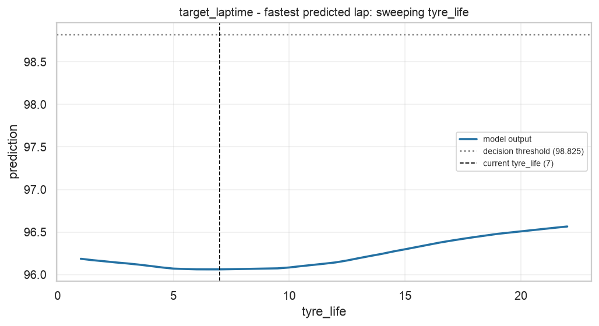
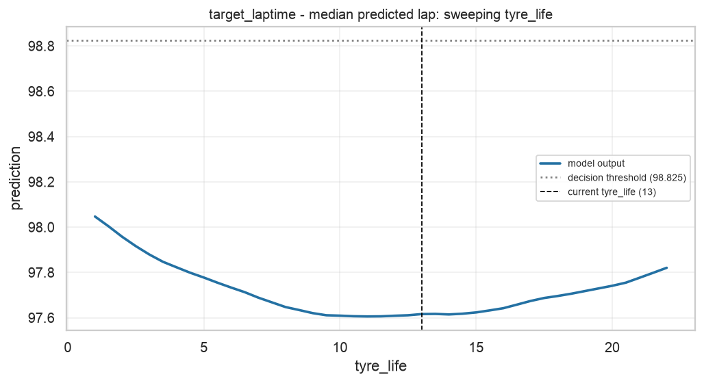
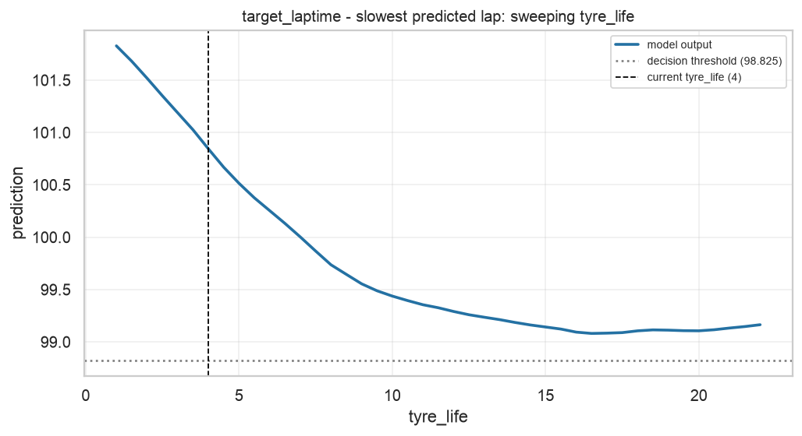
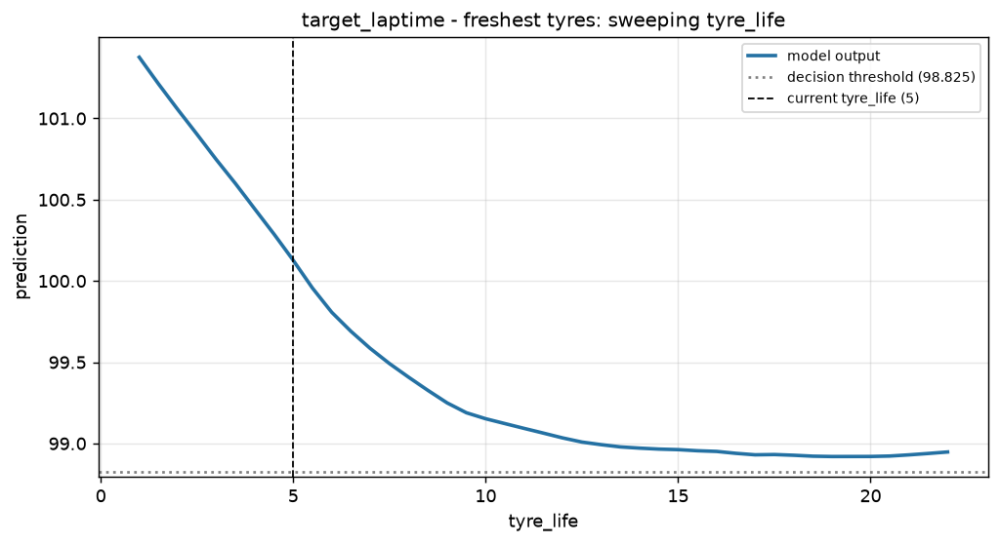
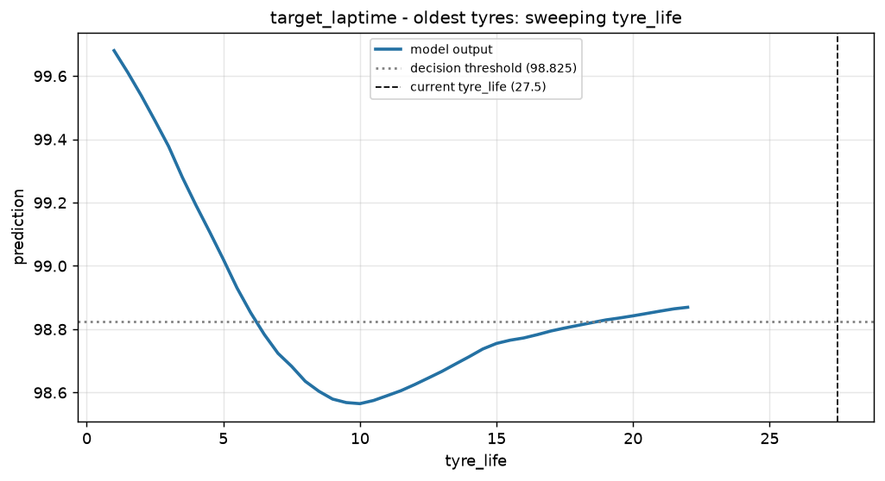
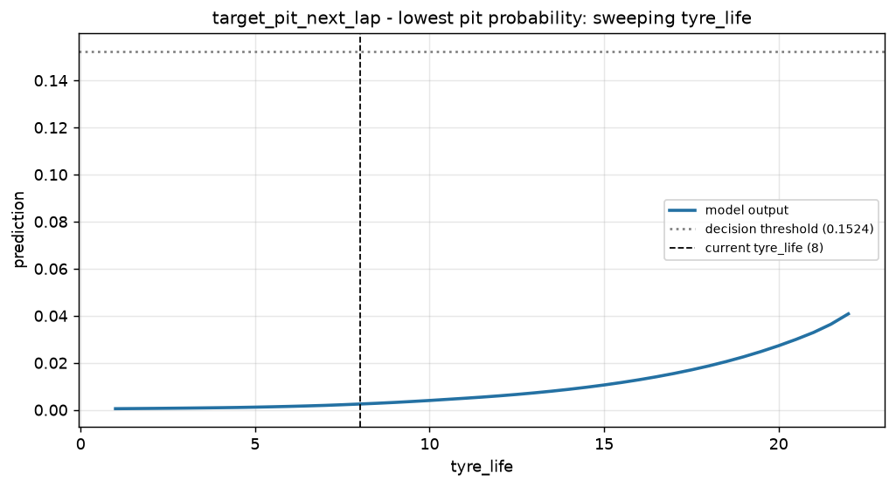
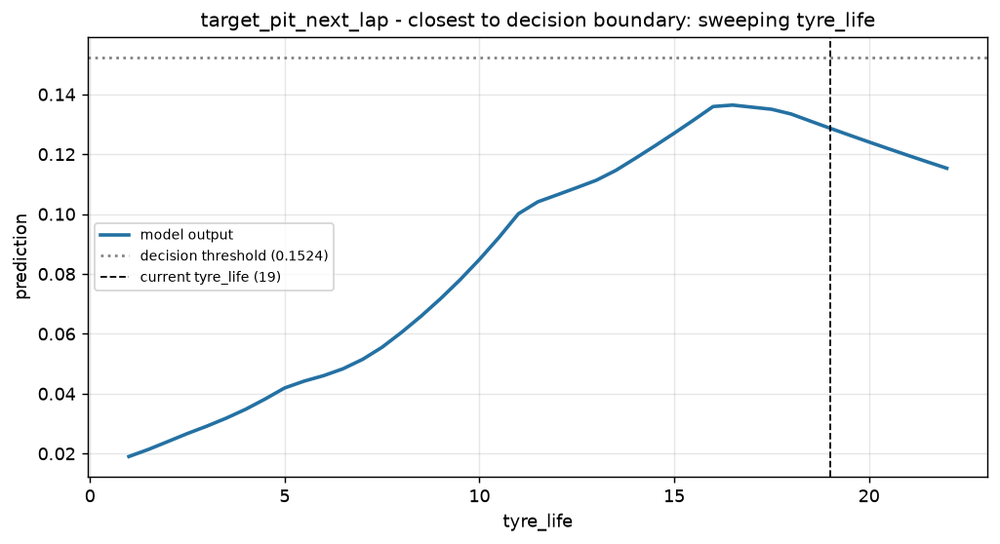
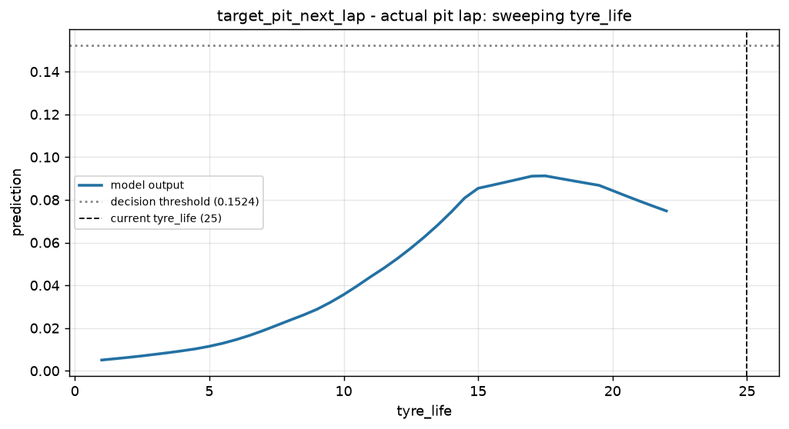

# Task 8 - Counterfactual Analysis Report

_Generated 2026-09-27 16:54 UTC._

*What would have to change about the race state for the recommendation to flip?*

Two methods, for two different questions:

* **Single-feature bisection scan** - hold the entire race state fixed, move one
  feature, find the exact value at which the model's output crosses the decision
  threshold. This is the question a race engineer actually asks (*how many more
  laps on these tyres?*), because it yields an actionable instruction.
* **DiCE (random search)** - find complete alternative race states the model would
  classify the other way. Useful when several different routes to a different call
  exist; less actionable, because changing six things at once is not an instruction.

Every number below is the result of a real search against the real model. Where no
counterfactual exists inside the feature's observed range, that is reported as
*not reachable* together with the range searched.

## target_laptime

### Fastest Predicted Lap (test row 43, lap 47)

**Scanned feature:** `tyre_life`  |  **Current value:** 7  |  **Current prediction:** 96.0613  |  **Threshold:** 98.825

**Searched range:** [1, 22] in 43 steps

**Result: not reachable.** Tyre age swept over [1, 22] laps (the training range) in 0.5-lap steps; tracktemp_dev_x_tyrelife, tyrelife_x_soft, tyrelife_x_medium recomputed from it; compound, set freshness, track-temperature deviation and pace features held at this lap's values.

> Changing tyre age with the rest of the race state unchanged moves the predicted lap time by: -5 laps -> +0.095s; -2 laps -> +0.009s; +2 laps -> +0.009s; +5 laps -> +0.082s.

### Median Predicted Lap (test row 6, lap 53)

**Scanned feature:** `tyre_life`  |  **Current value:** 13  |  **Current prediction:** 97.6160  |  **Threshold:** 98.825

**Searched range:** [1, 22] in 43 steps

**Result: not reachable.** Tyre age swept over [1, 22] laps (the training range) in 0.5-lap steps; tracktemp_dev_x_tyrelife, tyrelife_x_soft, tyrelife_x_medium recomputed from it; compound, set freshness, track-temperature deviation and pace features held at this lap's values.

> Changing tyre age with the rest of the race state unchanged moves the predicted lap time by: -5 laps -> +0.031s; -2 laps -> -0.010s; +2 laps -> +0.007s; +5 laps -> +0.080s.

### Slowest Predicted Lap (test row 178, lap 55)

**Scanned feature:** `tyre_life`  |  **Current value:** 4  |  **Current prediction:** 100.8445  |  **Threshold:** 98.825

**Searched range:** [1, 22] in 43 steps

**Result: not reachable.** Tyre age swept over [1, 22] laps (the training range) in 0.5-lap steps; tracktemp_dev_x_tyrelife, tyrelife_x_soft, tyrelife_x_medium recomputed from it; compound, set freshness, track-temperature deviation and pace features held at this lap's values.

> Changing tyre age with the rest of the race state unchanged moves the predicted lap time by: -2 laps -> +0.674s; +2 laps -> -0.590s; +5 laps -> -1.289s.

### Freshest Tyres (test row 86, lap 48)

**Scanned feature:** `tyre_life`  |  **Current value:** 5  |  **Current prediction:** 100.1272  |  **Threshold:** 98.825

**Searched range:** [1, 22] in 43 steps

**Result: not reachable.** Tyre age swept over [1, 22] laps (the training range) in 0.5-lap steps; tracktemp_dev_x_tyrelife, tyrelife_x_soft, tyrelife_x_medium recomputed from it; compound, set freshness, track-temperature deviation and pace features held at this lap's values.

> Changing tyre age with the rest of the race state unchanged moves the predicted lap time by: -2 laps -> +0.620s; +2 laps -> -0.542s; +5 laps -> -0.975s.

### Oldest Tyres (test row 42, lap 56)

**Scanned feature:** `tyre_life`  |  **Current value:** 27.5  |  **Current prediction:** 98.9026  |  **Threshold:** 98.825

**Searched range:** [1, 22] in 43 steps

**Result: not reachable.** Tyre age swept over [1, 22] laps (the training range) in 0.5-lap steps; tracktemp_dev_x_tyrelife, tyrelife_x_soft, tyrelife_x_medium recomputed from it; compound, set freshness, track-temperature deviation and pace features held at this lap's values.

> This lap's tyre age lies outside the 1-22 range seen in training, so no in-range what-if is reported.

---

## target_pit_next_lap

### Lowest Pit Probability (test row 89, lap 51)

**Scanned feature:** `tyre_life`  |  **Current value:** 8  |  **Current prediction:** 0.0025  |  **Threshold:** 0.1524

**Searched range:** [1, 22] in 43 steps

**Result: not reachable.** Tyre age swept over [1, 22] laps (the training range) in 0.5-lap steps; tracktemp_dev_x_tyrelife, tyrelife_x_soft recomputed from it; compound, set freshness, track-temperature deviation and pace features held at this lap's values.

> No value of tyre age between 1 and 22 flips this recommendation with the rest of the race state unchanged - the call is not sensitive to tyre age alone.

### Closest To Decision Boundary (test row 171, lap 48)

**Scanned feature:** `tyre_life`  |  **Current value:** 19  |  **Current prediction:** 0.1287  |  **Threshold:** 0.1524

**Searched range:** [1, 22] in 43 steps

**Result: not reachable.** Tyre age swept over [1, 22] laps (the training range) in 0.5-lap steps; tracktemp_dev_x_tyrelife, tyrelife_x_soft recomputed from it; compound, set freshness, track-temperature deviation and pace features held at this lap's values.

> No value of tyre age between 1 and 22 flips this recommendation with the rest of the race state unchanged - the call is not sensitive to tyre age alone.

### Actual Pit Lap (test row 177, lap 54)

**Scanned feature:** `tyre_life`  |  **Current value:** 25  |  **Current prediction:** 0.0630  |  **Threshold:** 0.1524

**Searched range:** [1, 22] in 43 steps

**Result: not reachable.** Tyre age swept over [1, 22] laps (the training range) in 0.5-lap steps; tracktemp_dev_x_tyrelife, tyrelife_x_soft recomputed from it; compound, set freshness, track-temperature deviation and pace features held at this lap's values.

> No value of tyre age between 1 and 22 flips this recommendation with the rest of the race state unchanged - the call is not sensitive to tyre age alone. This lap's own tyre age (25) is outside that training range, so the model is extrapolating here.

### DiCE - diverse whole-row counterfactuals

_Each row above is a complete alternative race state the model would classify the other way. Values are in standardised units; a delta of +1.0 means one standard deviation of that feature as observed in training._

| # | Features changed | Changes |
|---:|---:|---|
| 1 | 1 | `tracktemp_dev_x_tyrelife` -17.276 -> +0.716 (+17.993) |
| 2 | 1 | `field_median_lag1` +97.432 -> +101.702 (+4.270) |
| 3 | 1 | `tracktemp_dev_x_tyrelife` -17.276 -> +6.705 (+23.981) |

---

