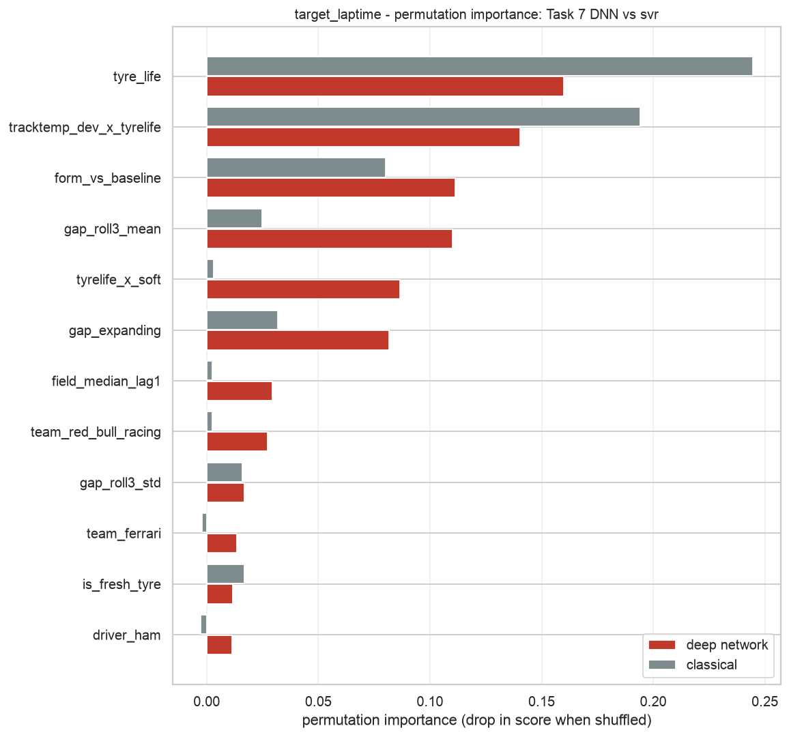
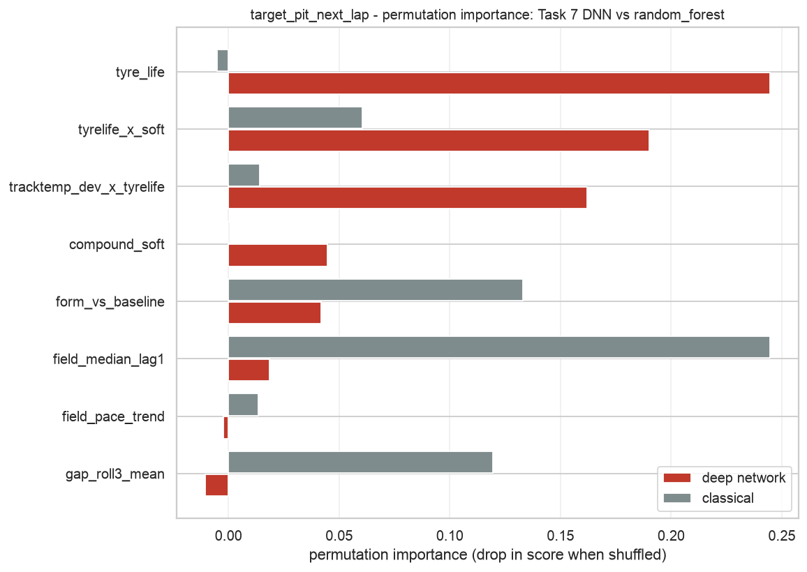

# Task 8 - Explainability Dashboard

_Generated 2026-09-27 17:57 UTC._

One page per target bringing together **global importance**, **per-prediction SHAP**,
the **trust score**, and the **plain-English recommendation** a race engineer would
actually read. This is the view that answers "why should I believe this?".

## target_laptime

**Task:** regression  |  **Deep network vs `svr`**  |  **Dataset:** `data/processed/fastf1_laps_clean.csv`

### Global feature importance (permutation, model-agnostic)

| Feature | Deep network | Classical | Rank gap |
|---|---:|---:|---:|
| `tyre_life` | 0.159984 | 0.244654 | 0 |
| `tracktemp_dev_x_tyrelife` | 0.140437 | 0.194227 | 0 |
| `form_vs_baseline` | 0.111300 | 0.080010 | 0 |
| `gap_roll3_mean` | 0.110250 | 0.024705 | 1 |
| `tyrelife_x_soft` | 0.086437 | 0.003030 | 16 |
| `gap_expanding` | 0.081712 | 0.031902 | 2 |
| `field_median_lag1` | 0.029520 | 0.002555 | 17 |
| `team_red_bull_racing` | 0.027377 | 0.002629 | 15 |
| `gap_roll3_std` | 0.017007 | 0.015980 | 2 |
| `team_ferrari` | 0.013476 | -0.002018 | 31 |

### Per-prediction explanations

#### Fastest Predicted Lap - test row 43, lap 47

> **Expected lap time 96.061s - 3.373s faster than an average lap. Current form against this driver's baseline (-1.693) is a major factor making this lap faster; the field's pace last lap (97.59) is a major factor making this lap faster; stint number (4) is a moderate factor making this lap faster. Trust in this prediction: HIGH.**

| Trust | 0.773 (HIGH) |
|---|---|
| Confidence | n/a |
| Model agreement | 0.809 |
| Explanation stability | 0.500 |
| Input validity | 1.000 |

_The two model families agree, the prediction is clear of the decision point, the explanations concur and the inputs are familiar. The strongest support this project-defined score can give - still not a guarantee._

**Top factors (SHAP):** `form_vs_baseline` (-0.8583), `field_median_lag1` (-0.7755), `stint_number` (-0.6211)

**Counterfactual:** Changing tyre age with the rest of the race state unchanged moves the predicted lap time by: -5 laps -> +0.095s; -2 laps -> +0.009s; +2 laps -> +0.009s; +5 laps -> +0.082s.

#### Median Predicted Lap - test row 6, lap 53

> **Expected lap time 97.616s - 1.818s faster than an average lap. The field's pace last lap (97.59) is a major factor making this lap faster; stint number (4) is a major factor making this lap faster; track temperature acting on tyre age (-14.42) is a moderate factor making this lap faster. Trust in this prediction: MODERATE.**

| Trust | 0.747 (MODERATE) |
|---|---|
| Confidence | n/a |
| Model agreement | 0.761 |
| Explanation stability | 0.500 |
| Input validity | 0.978 |

_Usable as one input among several. Read the SHAP factors first; at least one component is weak._

**Top factors (SHAP):** `field_median_lag1` (-0.8312), `stint_number` (-0.6759), `tracktemp_dev_x_tyrelife` (-0.5744)

**Counterfactual:** Changing tyre age with the rest of the race state unchanged moves the predicted lap time by: -5 laps -> +0.031s; -2 laps -> -0.010s; +2 laps -> +0.007s; +5 laps -> +0.080s.

#### Slowest Predicted Lap - test row 178, lap 55

> **Expected lap time 100.844s - 1.410s slower than an average lap. Current form against this driver's baseline (3.268) is the dominant factor making this lap slower; recent pace gap to the field (2.056) is a moderate factor making this lap faster; tyre age (4) is a minor factor making this lap slower. Trust in this prediction: LOW.**

| Trust | 0.495 (LOW) |
|---|---|
| Confidence | n/a |
| Model agreement | 0.327 |
| Explanation stability | 0.200 |
| Input validity | 1.000 |

_A prompt to look at the evidence, not a recommendation. The models disagree, the explanations do, or the inputs are unusual._

**Top factors (SHAP):** `form_vs_baseline` (+1.8825), `gap_roll3_mean` (-0.5880), `tyre_life` (+0.3220)

**Counterfactual:** Changing tyre age with the rest of the race state unchanged moves the predicted lap time by: -2 laps -> +0.674s; +2 laps -> -0.590s; +5 laps -> -1.289s.

#### Freshest Tyres - test row 86, lap 48

> **Expected lap time 100.127s - 0.693s slower than an average lap. Current form against this driver's baseline (2.586) is the dominant factor making this lap slower; wind speed (0.1) is a moderate factor making this lap faster; the field's pace last lap (97.43) is a moderate factor making this lap faster. Trust in this prediction: MODERATE.**

| Trust | 0.647 (MODERATE) |
|---|---|
| Confidence | n/a |
| Model agreement | 0.499 |
| Explanation stability | 0.500 |
| Input validity | 0.978 |

_Usable as one input among several. Read the SHAP factors first; at least one component is weak._

**Top factors (SHAP):** `form_vs_baseline` (+1.4970), `wind_speed` (-0.5664), `field_median_lag1` (-0.4887)

**Counterfactual:** Changing tyre age with the rest of the race state unchanged moves the predicted lap time by: -2 laps -> +0.620s; +2 laps -> -0.542s; +5 laps -> -0.975s.

#### Oldest Tyres - test row 42, lap 56

> **Expected lap time 98.903s - 0.532s faster than an average lap. Track temperature acting on tyre age (-33.26) is a major factor making this lap faster; tyre age (27.5) is a moderate factor making this lap slower; the field's pace last lap (97.86) is a moderate factor making this lap faster. Trust in this prediction: MODERATE.**

| Trust | 0.685 (MODERATE) |
|---|---|
| Confidence | n/a |
| Model agreement | 0.856 |
| Explanation stability | 0.200 |
| Input validity | 0.956 |

_Usable as one input among several. Read the SHAP factors first; at least one component is weak._

**Top factors (SHAP):** `tracktemp_dev_x_tyrelife` (-1.6255), `tyre_life` (+1.0933), `field_median_lag1` (-0.6697)

**Counterfactual:** This lap's tyre age lies outside the 1-22 range seen in training, so no in-range what-if is reported.

---

## target_pit_next_lap

**Task:** classification  |  **Deep network vs `random_forest`**  |  **Dataset:** `data/processed/fastf1_laps_clean.csv`

### Global feature importance (permutation, model-agnostic)

| Feature | Deep network | Classical | Rank gap |
|---|---:|---:|---:|
| `tyre_life` | 0.244693 | -0.005028 | 7 |
| `tyrelife_x_soft` | 0.189944 | 0.060335 | 2 |
| `tracktemp_dev_x_tyrelife` | 0.162011 | 0.013966 | 2 |
| `compound_soft` | 0.044693 | 0.000559 | 3 |
| `form_vs_baseline` | 0.041899 | 0.132961 | 3 |
| `field_median_lag1` | 0.018436 | 0.244693 | 5 |
| `field_pace_trend` | -0.002235 | 0.013408 | 1 |
| `gap_roll3_mean` | -0.010615 | 0.119553 | 5 |

### Per-prediction explanations

#### Lowest Pit Probability - test row 89, lap 51

> **Recommend STAYING OUT - model confidence <1% (0.25%). Current form against this driver's baseline (-2.849) is a major factor pushing against stopping; track temperature acting on tyre age (-8.074) is a moderate factor pushing against stopping; tyre age on the soft compound (8) is a moderate factor pushing towards a stop. Trust in this recommendation: HIGH.**

| Trust | 0.971 (HIGH) |
|---|---|
| Confidence | 0.984 |
| Model agreement | 0.906 |
| Explanation stability | 1.000 |
| Input validity | 1.000 |

_The two model families agree, the prediction is clear of the decision point, the explanations concur and the inputs are familiar. The strongest support this project-defined score can give - still not a guarantee._

**Top factors (SHAP):** `form_vs_baseline` (-0.0435), `tracktemp_dev_x_tyrelife` (-0.0160), `tyrelife_x_soft` (+0.0152)

**Counterfactual:** No value of tyre age between 1 and 22 flips this recommendation with the rest of the race state unchanged - the call is not sensitive to tyre age alone.

#### Closest To Decision Boundary - test row 171, lap 48

> **Recommend STAYING OUT - model confidence 13%. Tyre age (19) is a major factor pushing towards a stop; track temperature acting on tyre age (-17.28) is a moderate factor pushing against stopping; tyre age on the soft compound (19) is a moderate factor pushing towards a stop. Trust in this recommendation: LOW.**

| Trust | 0.426 (LOW) |
|---|---|
| Confidence | 0.156 |
| Model agreement | 0.725 |
| Explanation stability | 0.200 |
| Input validity | 0.750 |

_A prompt to look at the evidence, not a recommendation. The models disagree, the explanations do, or the inputs are unusual._

**Top factors (SHAP):** `tyre_life` (+0.0492), `tracktemp_dev_x_tyrelife` (-0.0397), `tyrelife_x_soft` (+0.0354)

**Counterfactual:** No value of tyre age between 1 and 22 flips this recommendation with the rest of the race state unchanged - the call is not sensitive to tyre age alone.

#### Actual Pit Lap - test row 177, lap 54

> **Recommend STAYING OUT - model confidence 6%. Track temperature acting on tyre age (-27.73) is a major factor pushing against stopping; tyre age (25) is a major factor pushing towards a stop; tyre age on the soft compound (25) is a minor factor pushing towards a stop. Trust in this recommendation: MODERATE.**

| Trust | 0.551 (MODERATE) |
|---|---|
| Confidence | 0.587 |
| Model agreement | 0.484 |
| Explanation stability | 0.500 |
| Input validity | 0.625 |

_Usable as one input among several. Read the SHAP factors first; at least one component is weak._

**Top factors (SHAP):** `tracktemp_dev_x_tyrelife` (-0.0488), `tyre_life` (+0.0455), `tyrelife_x_soft` (+0.0152)

**Counterfactual:** No value of tyre age between 1 and 22 flips this recommendation with the rest of the race state unchanged - the call is not sensitive to tyre age alone. This lap's own tyre age (25) is outside that training range, so the model is extrapolating here.

---

