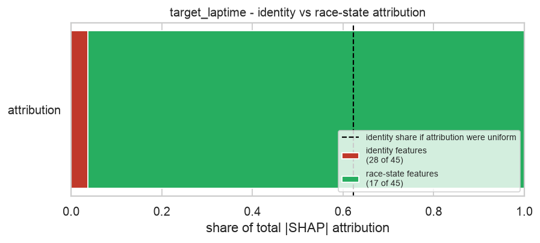
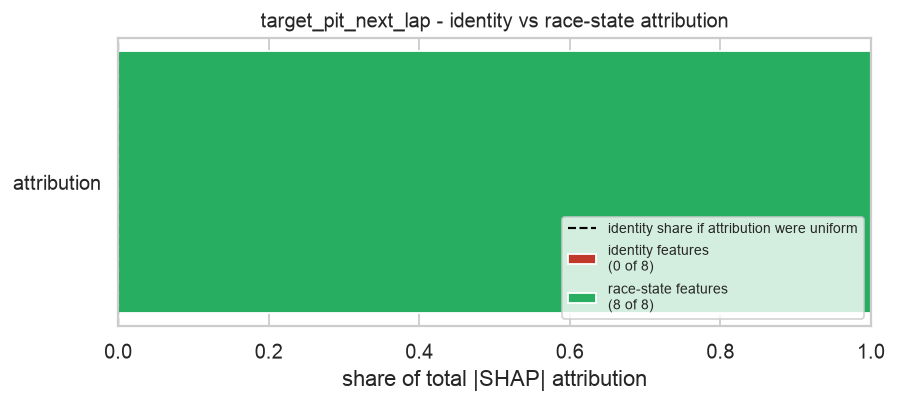

# Task 8 - Fairness Assessment

_Generated 2026-09-27 16:54 UTC._

**The question:** is the model predicting from *race state*, or from *who is driving*?

This is a concrete risk in this project, not a hypothetical one. Task 5's feature
selection retained one-hot driver and team dummies. A lap-time model leaning on
`driver_sai` has learned "Sainz laps look like this" rather than "a tyre this old
on a track this hot laps like this". Such a model cannot generalise to an unseen
driver, silently encodes car performance as driver pace, and would give two cars in
an identical race state different strategy calls purely because of the name on the car.

**The measurement:** share of total mean-|SHAP| attribution going to identity
features, compared against the share expected if attribution were spread evenly
across all features. The ratio of the two is the concentration.

## target_laptime

| | |
|---|---|
| Selected features | 45 |
| Identity features | 28 (`team_red_bull_racing`, `team_ferrari`, `team_aston_martin`, `driver_alo`, `driver_ham`, `team_mercedes`, `driver_gas`, `driver_ver`, `driver_str`, `driver_zho`, `driver_rus`, `driver_tsu`, `driver_per`, `driver_mag`, `team_mclaren`, `team_alphatauri`, `driver_sai`, `team_williams`, `driver_hul`, `team_haas_f1_team`, `driver_bot`, `driver_dev`, `driver_nor`, `driver_oco`, `team_alpine`, `driver_pia`, `driver_sar`, `driver_lec`) |
| **Identity share of attribution** | **3.8%** |
| Expected share if uniform | 62.2% |
| **Concentration ratio** | **0.06x** |
| Highest-ranked identity feature | {'feature': 'team_red_bull_racing', 'rank': 11} |
| Top race-state features | `field_median_lag1`, `tracktemp_dev_x_tyrelife`, `stint_number`, `tyre_life`, `form_vs_baseline` |

**Reading:** 28 of 45 selected features encode driver or team identity. They carry **3.8%** of the model's total attribution, against **62.2%** if attribution were spread evenly - a concentration of **0.06x**, at or below what an even spread would give. Race-state features dominate this model's reasoning, which is the desired outcome.

---

## target_pit_next_lap

| | |
|---|---|
| Selected features | 8 |
| Identity features | 0 (none) |
| **Identity share of attribution** | **0.0%** |
| Expected share if uniform | 0.0% |
| **Concentration ratio** | **n/ax** |
| Highest-ranked identity feature | n/a |
| Top race-state features | `tracktemp_dev_x_tyrelife`, `tyre_life`, `tyrelife_x_soft`, `compound_soft`, `form_vs_baseline` |

**Reading:** No driver or team identity features survived Task 5's selection funnel for this target, so this model cannot be leaning on identity - the risk does not arise here.

---

