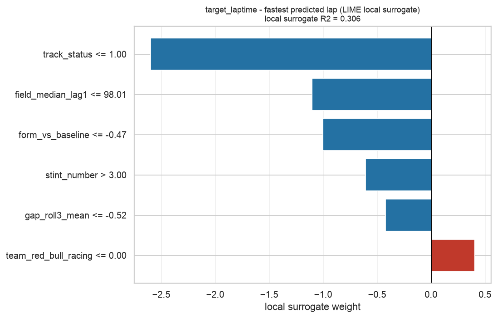
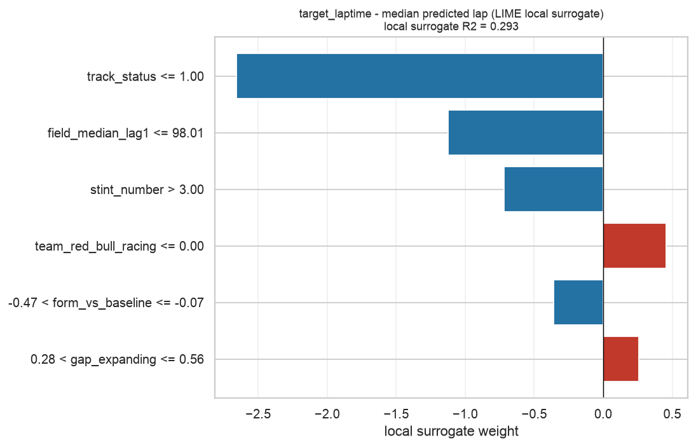
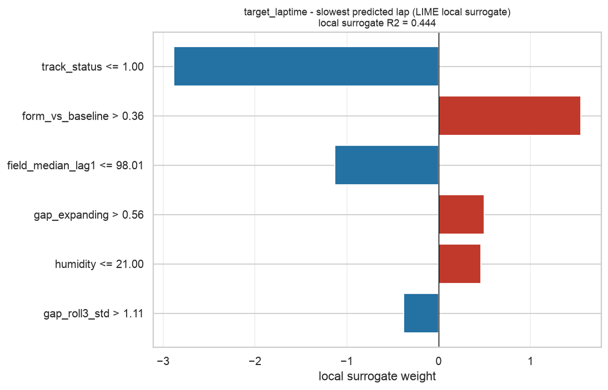
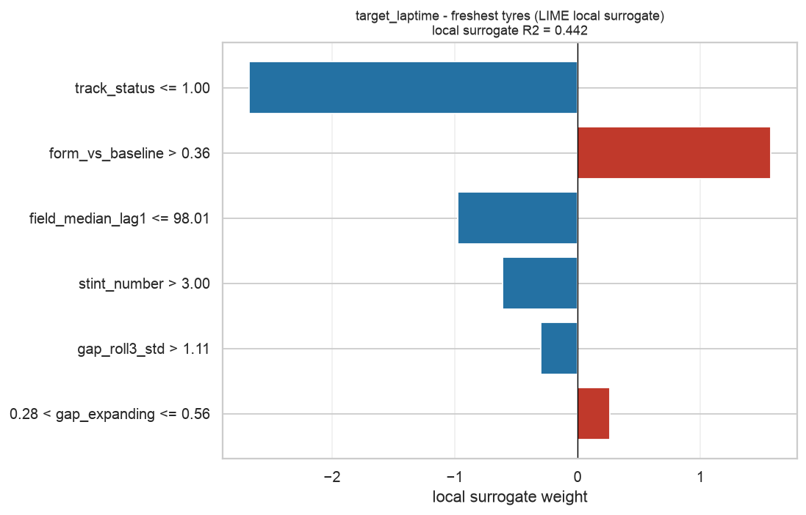
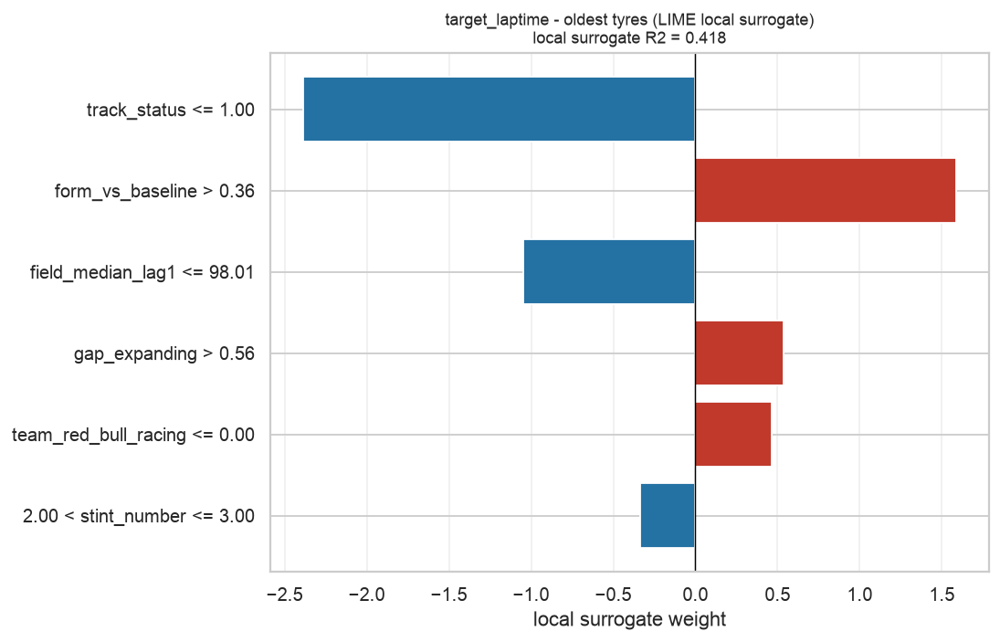
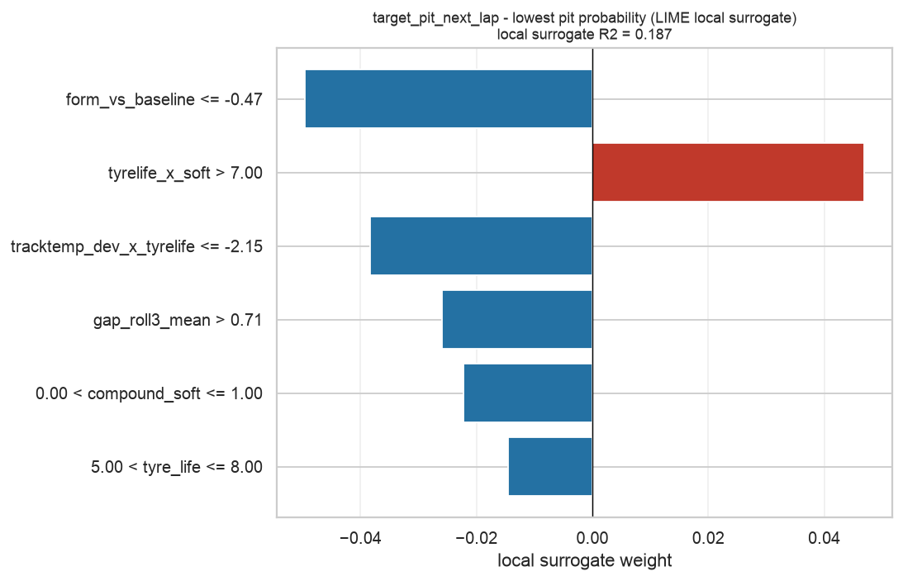
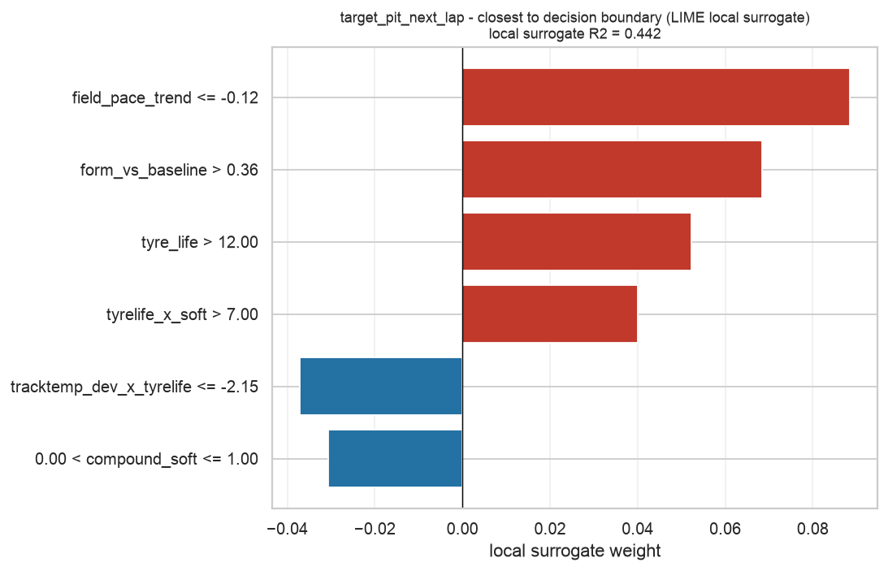
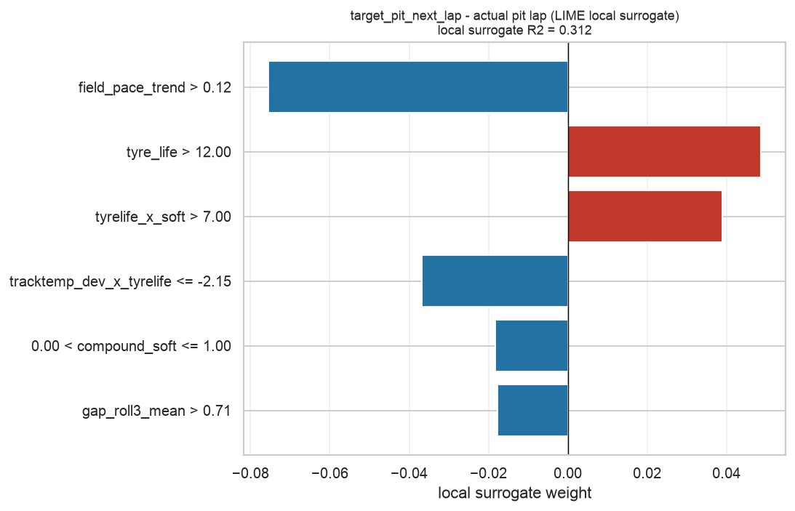

# Task 8 - LIME Report

_Generated 2026-09-27 17:57 UTC._

## How this differs from the SHAP report

LIME does **not** compute Shapley values. It perturbs the row being explained,
asks the real model what it predicts for each perturbation, and fits a weighted
**linear surrogate** to those answers in the neighbourhood of that row. The
reported weights are that surrogate's coefficients.

| | SHAP | LIME |
|---|---|---|
| Question answered | How is credit for this prediction fairly divided? | What simple model behaves like the real one *around here*? |
| Basis | Shapley values (game theory) | Local weighted linear regression |
| Guarantee | Attributions sum to (prediction - base value) | None; quality is reported as the surrogate's R2 |
| Output units | Same units as the model output | Surrogate coefficients on discretised conditions |

`local_r2` is the diagnostic that matters: a low value means a straight line is a
poor stand-in for the model near this row, so the LIME explanation should be
discounted regardless of how confident it looks.

## target_laptime

### Fastest Predicted Lap (test row 43, lap 47)

Local surrogate R2: **0.306** over 2000 perturbations.

| Condition | Weight | Effect |
|---|---:|---|
| `track_status <= 1.00` | -2.599326 | decreases the prediction |
| `field_median_lag1 <= 98.01` | -1.102806 | decreases the prediction |
| `form_vs_baseline <= -0.47` | -1.000789 | decreases the prediction |
| `stint_number > 3.00` | -0.606593 | decreases the prediction |
| `gap_roll3_mean <= -0.52` | -0.422908 | decreases the prediction |
| `team_red_bull_racing <= 0.00` | +0.404906 | increases the prediction |

**SHAP top-3:** `form_vs_baseline`, `field_median_lag1`, `stint_number`
**LIME top-3:** `track_status`, `field_median_lag1`, `form_vs_baseline`
**Agreement (Jaccard):** 0.500

### Median Predicted Lap (test row 6, lap 53)

Local surrogate R2: **0.293** over 2000 perturbations.

| Condition | Weight | Effect |
|---|---:|---|
| `track_status <= 1.00` | -2.657530 | decreases the prediction |
| `field_median_lag1 <= 98.01` | -1.123257 | decreases the prediction |
| `stint_number > 3.00` | -0.716850 | decreases the prediction |
| `team_red_bull_racing <= 0.00` | +0.457114 | increases the prediction |
| `-0.47 < form_vs_baseline <= -0.07` | -0.359858 | decreases the prediction |
| `0.28 < gap_expanding <= 0.56` | +0.258138 | increases the prediction |

**SHAP top-3:** `field_median_lag1`, `stint_number`, `tracktemp_dev_x_tyrelife`
**LIME top-3:** `track_status`, `field_median_lag1`, `stint_number`
**Agreement (Jaccard):** 0.500

### Slowest Predicted Lap (test row 178, lap 55)

Local surrogate R2: **0.444** over 2000 perturbations.

| Condition | Weight | Effect |
|---|---:|---|
| `track_status <= 1.00` | -2.884736 | decreases the prediction |
| `form_vs_baseline > 0.36` | +1.548584 | increases the prediction |
| `field_median_lag1 <= 98.01` | -1.132765 | decreases the prediction |
| `gap_expanding > 0.56` | +0.494008 | increases the prediction |
| `humidity <= 21.00` | +0.458565 | increases the prediction |
| `gap_roll3_std > 1.11` | -0.378854 | decreases the prediction |

**SHAP top-3:** `form_vs_baseline`, `gap_roll3_mean`, `tyre_life`
**LIME top-3:** `track_status`, `form_vs_baseline`, `field_median_lag1`
**Agreement (Jaccard):** 0.200

### Freshest Tyres (test row 86, lap 48)

Local surrogate R2: **0.442** over 2000 perturbations.

| Condition | Weight | Effect |
|---|---:|---|
| `track_status <= 1.00` | -2.677831 | decreases the prediction |
| `form_vs_baseline > 0.36` | +1.575523 | increases the prediction |
| `field_median_lag1 <= 98.01` | -0.977242 | decreases the prediction |
| `stint_number > 3.00` | -0.609167 | decreases the prediction |
| `gap_roll3_std > 1.11` | -0.302292 | decreases the prediction |
| `0.28 < gap_expanding <= 0.56` | +0.259993 | increases the prediction |

**SHAP top-3:** `form_vs_baseline`, `wind_speed`, `field_median_lag1`
**LIME top-3:** `track_status`, `form_vs_baseline`, `field_median_lag1`
**Agreement (Jaccard):** 0.500

### Oldest Tyres (test row 42, lap 56)

Local surrogate R2: **0.418** over 2000 perturbations.

| Condition | Weight | Effect |
|---|---:|---|
| `track_status <= 1.00` | -2.387444 | decreases the prediction |
| `form_vs_baseline > 0.36` | +1.586333 | increases the prediction |
| `field_median_lag1 <= 98.01` | -1.045256 | decreases the prediction |
| `gap_expanding > 0.56` | +0.534699 | increases the prediction |
| `team_red_bull_racing <= 0.00` | +0.466994 | increases the prediction |
| `2.00 < stint_number <= 3.00` | -0.334352 | decreases the prediction |

**SHAP top-3:** `tracktemp_dev_x_tyrelife`, `tyre_life`, `field_median_lag1`
**LIME top-3:** `track_status`, `form_vs_baseline`, `field_median_lag1`
**Agreement (Jaccard):** 0.200

---

## target_pit_next_lap

### Lowest Pit Probability (test row 89, lap 51)

Local surrogate R2: **0.187** over 2000 perturbations.

| Condition | Weight | Effect |
|---|---:|---|
| `form_vs_baseline <= -0.47` | -0.049604 | decreases the prediction |
| `tyrelife_x_soft > 7.00` | +0.046954 | increases the prediction |
| `tracktemp_dev_x_tyrelife <= -2.15` | -0.038389 | decreases the prediction |
| `gap_roll3_mean > 0.71` | -0.025958 | decreases the prediction |
| `0.00 < compound_soft <= 1.00` | -0.022293 | decreases the prediction |
| `5.00 < tyre_life <= 8.00` | -0.014489 | decreases the prediction |

**SHAP top-3:** `form_vs_baseline`, `tracktemp_dev_x_tyrelife`, `tyrelife_x_soft`
**LIME top-3:** `form_vs_baseline`, `tyrelife_x_soft`, `tracktemp_dev_x_tyrelife`
**Agreement (Jaccard):** 1.000

### Closest To Decision Boundary (test row 171, lap 48)

Local surrogate R2: **0.442** over 2000 perturbations.

| Condition | Weight | Effect |
|---|---:|---|
| `field_pace_trend <= -0.12` | +0.088534 | increases the prediction |
| `form_vs_baseline > 0.36` | +0.068382 | increases the prediction |
| `tyre_life > 12.00` | +0.052275 | increases the prediction |
| `tyrelife_x_soft > 7.00` | +0.039985 | increases the prediction |
| `tracktemp_dev_x_tyrelife <= -2.15` | -0.037137 | decreases the prediction |
| `0.00 < compound_soft <= 1.00` | -0.030642 | decreases the prediction |

**SHAP top-3:** `tyre_life`, `tracktemp_dev_x_tyrelife`, `tyrelife_x_soft`
**LIME top-3:** `field_pace_trend`, `form_vs_baseline`, `tyre_life`
**Agreement (Jaccard):** 0.200

### Actual Pit Lap (test row 177, lap 54)

Local surrogate R2: **0.312** over 2000 perturbations.

| Condition | Weight | Effect |
|---|---:|---|
| `field_pace_trend > 0.12` | -0.075492 | decreases the prediction |
| `tyre_life > 12.00` | +0.048735 | increases the prediction |
| `tyrelife_x_soft > 7.00` | +0.038938 | increases the prediction |
| `tracktemp_dev_x_tyrelife <= -2.15` | -0.036753 | decreases the prediction |
| `0.00 < compound_soft <= 1.00` | -0.018194 | decreases the prediction |
| `gap_roll3_mean > 0.71` | -0.017765 | decreases the prediction |

**SHAP top-3:** `tracktemp_dev_x_tyrelife`, `tyre_life`, `tyrelife_x_soft`
**LIME top-3:** `field_pace_trend`, `tyre_life`, `tyrelife_x_soft`
**Agreement (Jaccard):** 0.500

---

