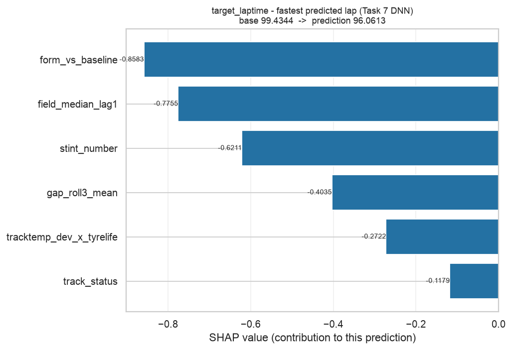
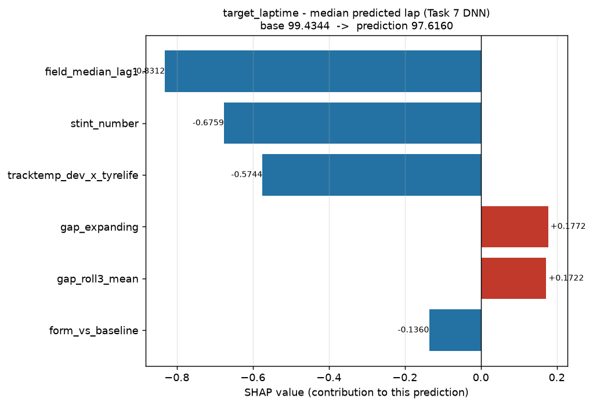
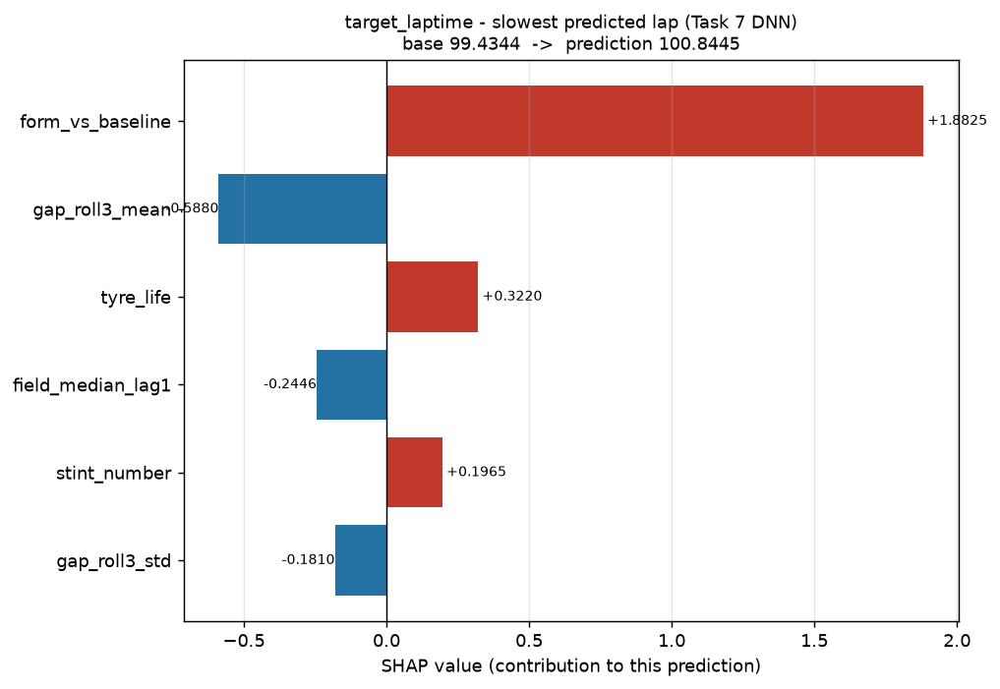
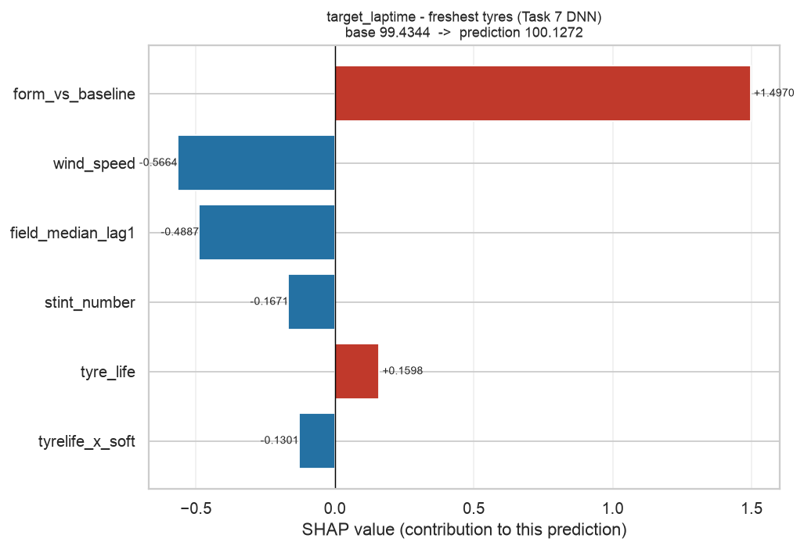
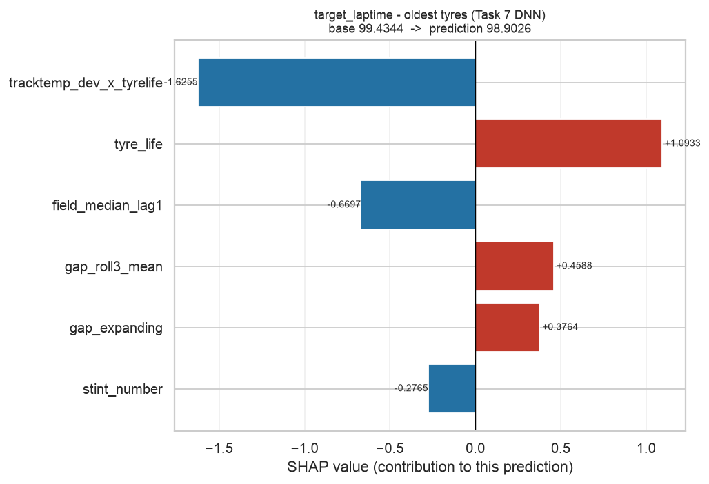
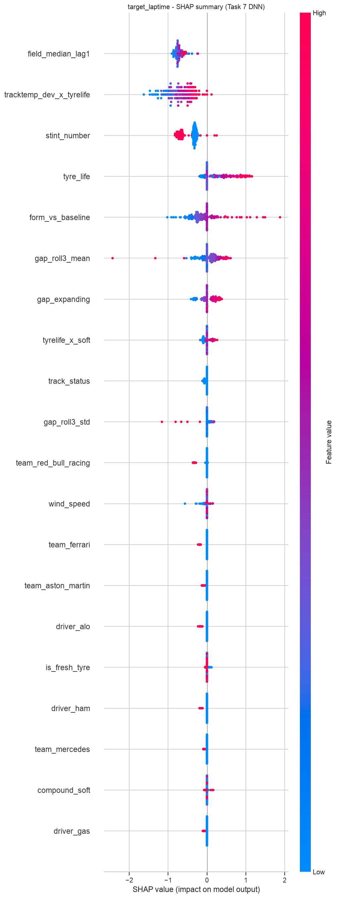
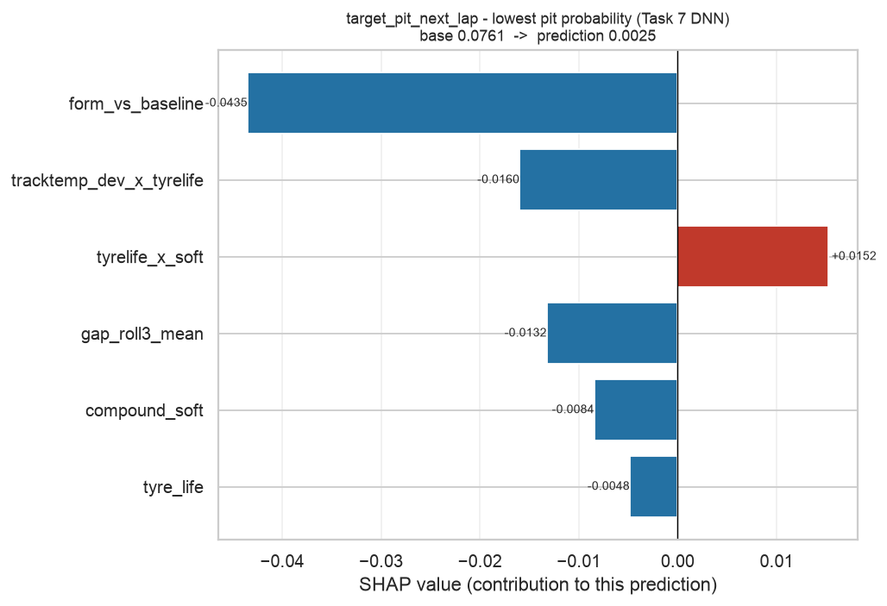
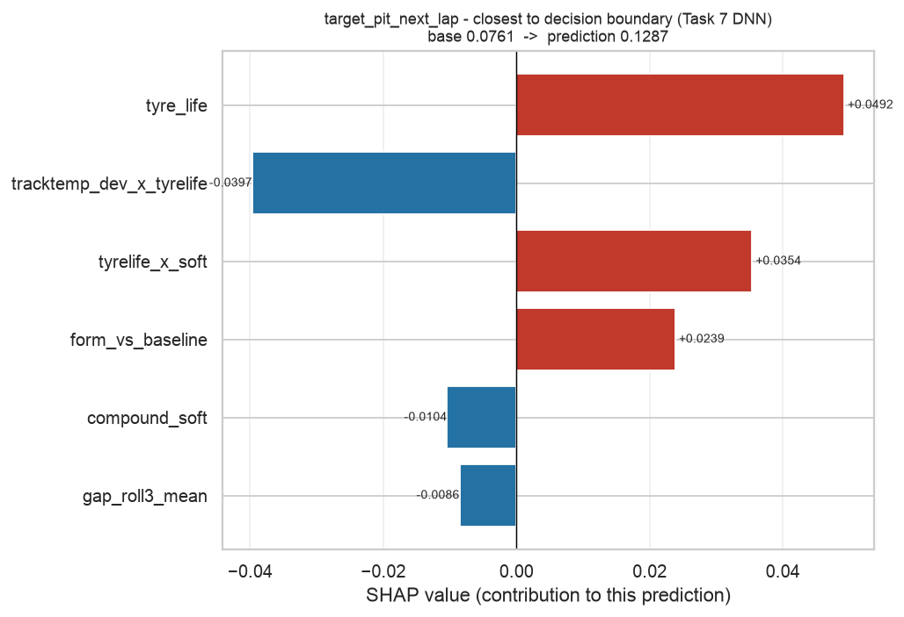
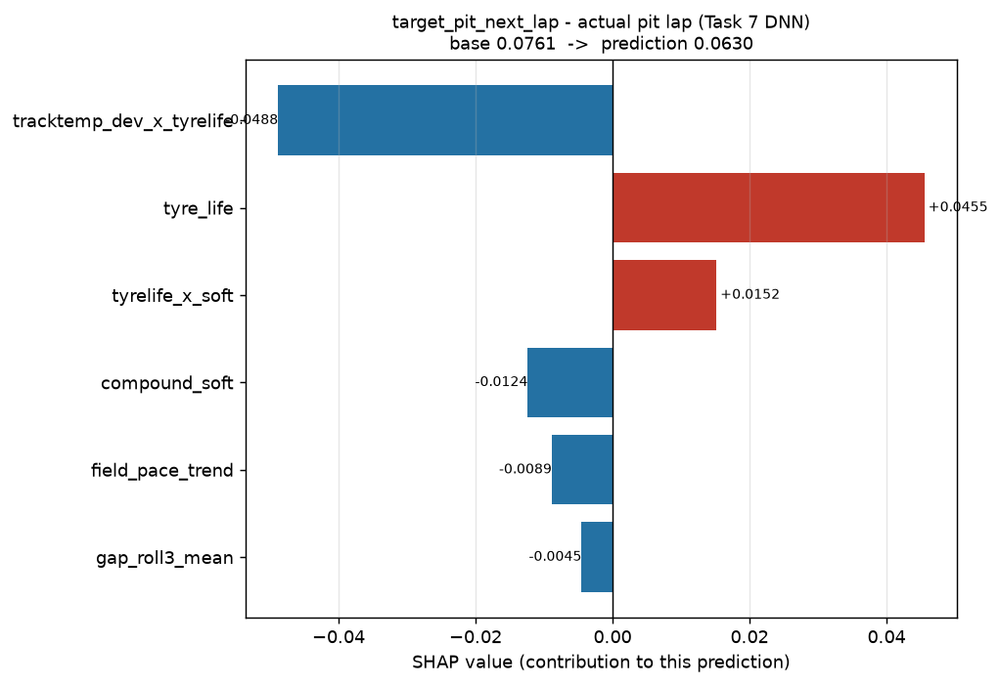
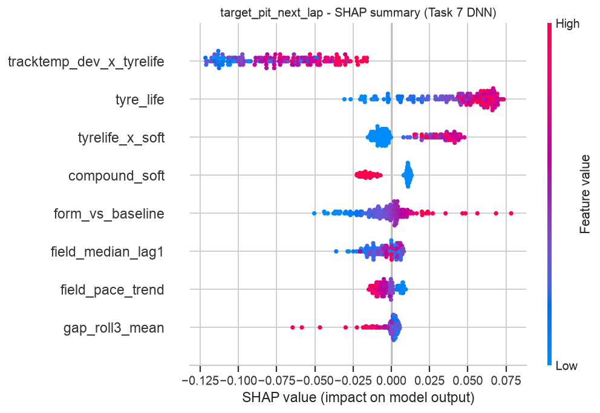

# Task 8 - SHAP Report

_Generated 2026-09-27 16:54 UTC._

SHAP distributes the gap between a prediction and the average prediction
among the input features, using Shapley values from cooperative game theory.
The attributions below are computed on the untouched chronological test set.

## Explainer choice

| Model | Explainer | Exact? | Why |
|---|---|---|---|
| Classical (random forest) | `TreeExplainer` | **Yes** | Walks the ensemble directly; exact Shapley values in polynomial time. |
| Deep network (Keras) | `KernelExplainer` | No - sampled | Model-agnostic, needs only a `predict` function. `DeepExplainer`'s Keras 3 support targets the TensorFlow backend; this project runs Keras on PyTorch, so `KernelExplainer` is the correct choice. |

> **Trade-off:** the network's values carry sampling noise the forest's do not.
> Compare them by **rank and sign**, not by magnitude.

## target_laptime

**Task:** regression  |  **Test rows explained:** 180  |  **Dataset:** `data/processed/fastf1_laps_clean.csv`

### Global ranking - deep network

_Approximate Shapley values sampled with nsamples=200 over a k-means background of 25 points. Ranks and signs are meaningful; magnitudes carry sampling noise and are not directly comparable to TreeExplainer's exact values._

| Rank | Feature | Mean \|SHAP\| |
|---:|---|---:|
| 1 | `field_median_lag1` | 0.726594 |
| 2 | `tracktemp_dev_x_tyrelife` | 0.687845 |
| 3 | `stint_number` | 0.456250 |
| 4 | `tyre_life` | 0.361673 |
| 5 | `form_vs_baseline` | 0.271938 |
| 6 | `gap_roll3_mean` | 0.191595 |
| 7 | `gap_expanding` | 0.157310 |
| 8 | `tyrelife_x_soft` | 0.074941 |
| 9 | `track_status` | 0.050625 |
| 10 | `gap_roll3_std` | 0.044330 |
| 11 | `team_red_bull_racing` | 0.039774 |
| 12 | `wind_speed` | 0.029778 |
| 13 | `team_ferrari` | 0.011479 |
| 14 | `team_aston_martin` | 0.010708 |
| 15 | `driver_alo` | 0.010167 |
| 16 | `is_fresh_tyre` | 0.010141 |
| 17 | `driver_ham` | 0.009001 |
| 18 | `team_mercedes` | 0.006626 |
| 19 | `compound_soft` | 0.006162 |
| 20 | `driver_gas` | 0.004590 |
| 21 | `driver_ver` | 0.004352 |
| 22 | `driver_str` | 0.003997 |
| 23 | `driver_zho` | 0.003599 |
| 24 | `driver_rus` | 0.003258 |
| 25 | `field_pace_trend` | 0.002784 |
| 26 | `driver_tsu` | 0.001728 |
| 27 | `driver_per` | 0.001614 |
| 28 | `driver_mag` | 0.001576 |
| 29 | `team_mclaren` | 0.001566 |
| 30 | `team_alphatauri` | 0.001385 |
| 31 | `tyrelife_x_medium` | 0.001363 |
| 32 | `compound_medium` | 0.001246 |
| 33 | `driver_sai` | 0.001236 |
| 34 | `team_williams` | 0.001228 |
| 35 | `driver_hul` | 0.000653 |
| 36 | `humidity` | 0.000586 |
| 37 | `team_haas_f1_team` | 0.000456 |
| 38 | `driver_bot` | 0.000390 |
| 39 | `driver_dev` | 0.000376 |
| 40 | `driver_nor` | 0.000271 |
| 41 | `driver_oco` | 0.000000 |
| 42 | `team_alpine` | 0.000000 |
| 43 | `driver_pia` | 0.000000 |
| 44 | `driver_sar` | 0.000000 |
| 45 | `driver_lec` | 0.000000 |

### Global ranking - svr

_Approximate Shapley values sampled with nsamples=60 over a k-means background of 25 points. Ranks and signs are meaningful; magnitudes carry sampling noise and are not directly comparable to TreeExplainer's exact values._

| Rank | Feature | Mean \|SHAP\| |
|---:|---|---:|
| 1 | `stint_number` | 0.468331 |
| 2 | `tracktemp_dev_x_tyrelife` | 0.458424 |
| 3 | `tyre_life` | 0.347920 |
| 4 | `field_median_lag1` | 0.278125 |
| 5 | `form_vs_baseline` | 0.166605 |
| 6 | `gap_roll3_mean` | 0.098847 |
| 7 | `gap_roll3_std` | 0.073139 |
| 8 | `tyrelife_x_soft` | 0.058210 |
| 9 | `gap_expanding` | 0.052076 |
| 10 | `track_status` | 0.046786 |
| 11 | `team_red_bull_racing` | 0.046773 |
| 12 | `wind_speed` | 0.041363 |
| 13 | `is_fresh_tyre` | 0.040481 |
| 14 | `field_pace_trend` | 0.030945 |
| 15 | `team_alphatauri` | 0.023876 |
| 16 | `team_haas_f1_team` | 0.023702 |
| 17 | `compound_soft` | 0.022405 |
| 18 | `team_mclaren` | 0.022025 |
| 19 | `team_aston_martin` | 0.021817 |
| 20 | `driver_nor` | 0.021579 |
| 21 | `driver_ver` | 0.015798 |
| 22 | `driver_mag` | 0.014947 |
| 23 | `tyrelife_x_medium` | 0.013768 |
| 24 | `humidity` | 0.013494 |
| 25 | `team_mercedes` | 0.012128 |
| 26 | `team_williams` | 0.011916 |
| 27 | `compound_medium` | 0.010625 |
| 28 | `driver_sar` | 0.010444 |
| 29 | `driver_zho` | 0.008667 |
| 30 | `driver_alo` | 0.007601 |
| 31 | `driver_dev` | 0.007519 |
| 32 | `driver_bot` | 0.007208 |
| 33 | `driver_hul` | 0.003461 |
| 34 | `driver_per` | 0.002562 |
| 35 | `driver_rus` | 0.002181 |
| 36 | `driver_ham` | 0.002156 |
| 37 | `team_alpine` | 0.001917 |
| 38 | `team_ferrari` | 0.001530 |
| 39 | `driver_tsu` | 0.001294 |
| 40 | `driver_gas` | 0.001227 |
| 41 | `driver_sai` | 0.000483 |
| 42 | `driver_str` | 0.000180 |
| 43 | `driver_oco` | 0.000000 |
| 44 | `driver_pia` | 0.000000 |
| 45 | `driver_lec` | 0.000000 |

### Representative predictions explained

#### Fastest Predicted Lap (test row 43, lap 47)

Deep network prediction: **96.0613**  |  svr: **96.4529**

| Feature | Value | SHAP | Effect |
|---|---:|---:|---|
| `form_vs_baseline` | -1.693 | -0.858260 | decreases the prediction |
| `field_median_lag1` | 97.59 | -0.775473 | decreases the prediction |
| `stint_number` | 4 | -0.621140 | decreases the prediction |
| `gap_roll3_mean` | -1.405 | -0.403543 | decreases the prediction |
| `tracktemp_dev_x_tyrelife` | -6.365 | -0.272205 | decreases the prediction |
| `track_status` | 1 | -0.117946 | decreases the prediction |

Same lap, svr (KernelExplainer (sampled) on 45 model inputs): `stint_number` (-0.8666), `form_vs_baseline` (-0.4012), `tyre_life` (-0.3635).
Comparing the two families on one lap shows whether they credit the same factors.

#### Median Predicted Lap (test row 6, lap 53)

Deep network prediction: **97.6160**  |  svr: **98.1056**

| Feature | Value | SHAP | Effect |
|---|---:|---:|---|
| `field_median_lag1` | 97.59 | -0.831157 | decreases the prediction |
| `stint_number` | 4 | -0.675932 | decreases the prediction |
| `tracktemp_dev_x_tyrelife` | -14.42 | -0.574449 | decreases the prediction |
| `gap_expanding` | 0.3635 | +0.177155 | increases the prediction |
| `gap_roll3_mean` | 0.128 | +0.172163 | increases the prediction |
| `form_vs_baseline` | -0.09151 | -0.136046 | decreases the prediction |

Same lap, svr (KernelExplainer (sampled) on 45 model inputs): `stint_number` (-0.5523), `field_median_lag1` (-0.3858), `form_vs_baseline` (-0.2306).
Comparing the two families on one lap shows whether they credit the same factors.

#### Slowest Predicted Lap (test row 178, lap 55)

Deep network prediction: **100.8445**  |  svr: **102.2228**

| Feature | Value | SHAP | Effect |
|---|---:|---:|---|
| `form_vs_baseline` | 3.268 | +1.882532 | increases the prediction |
| `gap_roll3_mean` | 2.056 | -0.587966 | decreases the prediction |
| `tyre_life` | 4 | +0.322026 | increases the prediction |
| `field_median_lag1` | 97.78 | -0.244623 | decreases the prediction |
| `stint_number` | 4 | +0.196493 | increases the prediction |
| `gap_roll3_std` | 1.851 | -0.181040 | decreases the prediction |

Same lap, svr (KernelExplainer (sampled) on 45 model inputs): `form_vs_baseline` (+2.3797), `tyre_life` (+0.9113), `gap_roll3_mean` (-0.6295).
Comparing the two families on one lap shows whether they credit the same factors.

#### Freshest Tyres (test row 86, lap 48)

Deep network prediction: **100.1272**  |  svr: **101.1514**

| Feature | Value | SHAP | Effect |
|---|---:|---:|---|
| `form_vs_baseline` | 2.586 | +1.496969 | increases the prediction |
| `wind_speed` | 0.1 | -0.566436 | decreases the prediction |
| `field_median_lag1` | 97.43 | -0.488669 | decreases the prediction |
| `stint_number` | 4.5 | -0.167076 | decreases the prediction |
| `tyre_life` | 5 | +0.159825 | increases the prediction |
| `tyrelife_x_soft` | 5 | -0.130054 | decreases the prediction |

Same lap, svr (KernelExplainer (sampled) on 45 model inputs): `form_vs_baseline` (+1.7272), `stint_number` (-0.6747), `tyre_life` (+0.4077).
Comparing the two families on one lap shows whether they credit the same factors.

#### Oldest Tyres (test row 42, lap 56)

Deep network prediction: **98.9026**  |  svr: **99.1979**

| Feature | Value | SHAP | Effect |
|---|---:|---:|---|
| `tracktemp_dev_x_tyrelife` | -33.26 | -1.625456 | decreases the prediction |
| `tyre_life` | 27.5 | +1.093274 | increases the prediction |
| `field_median_lag1` | 97.86 | -0.669681 | decreases the prediction |
| `gap_roll3_mean` | 1.285 | +0.458783 | increases the prediction |
| `gap_expanding` | 0.9587 | +0.376375 | increases the prediction |
| `stint_number` | 3 | -0.276458 | decreases the prediction |

Same lap, svr (KernelExplainer (sampled) on 45 model inputs): `tracktemp_dev_x_tyrelife` (-1.1989), `tyre_life` (+0.9155), `stint_number` (-0.3102).
Comparing the two families on one lap shows whether they credit the same factors.

---

## target_pit_next_lap

**Task:** classification  |  **Test rows explained:** 180  |  **Dataset:** `data/processed/fastf1_laps_clean.csv`

### Global ranking - deep network

_Approximate Shapley values sampled with nsamples=200 over a k-means background of 25 points. Ranks and signs are meaningful; magnitudes carry sampling noise and are not directly comparable to TreeExplainer's exact values._

| Rank | Feature | Mean \|SHAP\| |
|---:|---|---:|
| 1 | `tracktemp_dev_x_tyrelife` | 0.071043 |
| 2 | `tyre_life` | 0.045260 |
| 3 | `tyrelife_x_soft` | 0.018567 |
| 4 | `compound_soft` | 0.013383 |
| 5 | `form_vs_baseline` | 0.012195 |
| 6 | `field_median_lag1` | 0.007688 |
| 7 | `field_pace_trend` | 0.006046 |
| 8 | `gap_roll3_mean` | 0.004496 |

### Global ranking - random_forest

_Exact Shapley values; TreeExplainer enumerates the ensemble rather than sampling._

| Rank | Feature | Mean \|SHAP\| |
|---:|---|---:|
| 1 | `tyre_life` | 0.113444 |
| 2 | `tracktemp_dev_x_tyrelife` | 0.111478 |
| 3 | `form_vs_baseline` | 0.078155 |
| 4 | `field_median_lag1` | 0.060573 |
| 5 | `tyrelife_x_soft` | 0.052117 |
| 6 | `gap_roll3_mean` | 0.045295 |
| 7 | `field_pace_trend` | 0.043422 |
| 8 | `compound_soft` | 0.003690 |

### Representative predictions explained

#### Lowest Pit Probability (test row 89, lap 51)

Deep network prediction: **0.0025**  |  random_forest: **0.0960**

| Feature | Value | SHAP | Effect |
|---|---:|---:|---|
| `form_vs_baseline` | -2.849 | -0.043507 | decreases the prediction |
| `tracktemp_dev_x_tyrelife` | -8.074 | -0.015994 | decreases the prediction |
| `tyrelife_x_soft` | 8 | +0.015222 | increases the prediction |
| `gap_roll3_mean` | 1.87 | -0.013242 | decreases the prediction |
| `compound_soft` | 1 | -0.008445 | decreases the prediction |
| `tyre_life` | 8 | -0.004849 | decreases the prediction |

Same lap, random_forest (TreeExplainer (exact) on 8 model inputs): `tyre_life` (-0.1693), `form_vs_baseline` (-0.1028), `tyrelife_x_soft` (-0.0486).
Comparing the two families on one lap shows whether they credit the same factors.

#### Closest To Decision Boundary (test row 171, lap 48)

Deep network prediction: **0.1287**  |  random_forest: **0.4034**

| Feature | Value | SHAP | Effect |
|---|---:|---:|---|
| `tyre_life` | 19 | +0.049202 | increases the prediction |
| `tracktemp_dev_x_tyrelife` | -17.28 | -0.039695 | decreases the prediction |
| `tyrelife_x_soft` | 19 | +0.035403 | increases the prediction |
| `form_vs_baseline` | 1.312 | +0.023851 | increases the prediction |
| `compound_soft` | 1 | -0.010420 | decreases the prediction |
| `gap_roll3_mean` | 1.131 | -0.008565 | decreases the prediction |

Same lap, random_forest (TreeExplainer (exact) on 8 model inputs): `field_median_lag1` (-0.2086), `tracktemp_dev_x_tyrelife` (-0.1533), `tyre_life` (+0.0975).
Comparing the two families on one lap shows whether they credit the same factors.

#### Actual Pit Lap (test row 177, lap 54)

Deep network prediction: **0.0630**  |  random_forest: **0.5793**

| Feature | Value | SHAP | Effect |
|---|---:|---:|---|
| `tracktemp_dev_x_tyrelife` | -27.73 | -0.048817 | decreases the prediction |
| `tyre_life` | 25 | +0.045514 | increases the prediction |
| `tyrelife_x_soft` | 25 | +0.015164 | increases the prediction |
| `compound_soft` | 1 | -0.012362 | decreases the prediction |
| `field_pace_trend` | 0.189 | -0.008864 | decreases the prediction |
| `gap_roll3_mean` | 0.9977 | -0.004509 | decreases the prediction |

Same lap, random_forest (TreeExplainer (exact) on 8 model inputs): `tracktemp_dev_x_tyrelife` (-0.1427), `tyre_life` (+0.1239), `tyrelife_x_soft` (+0.0845).
Comparing the two families on one lap shows whether they credit the same factors.

---

