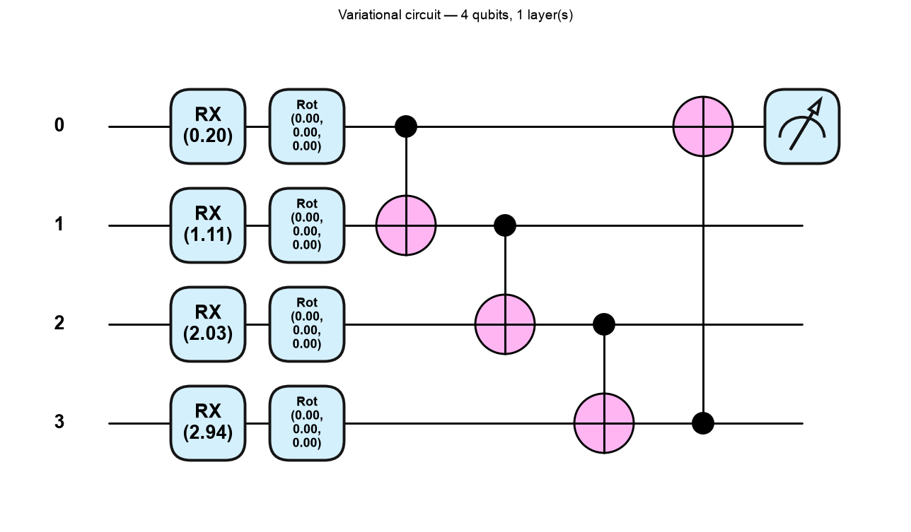
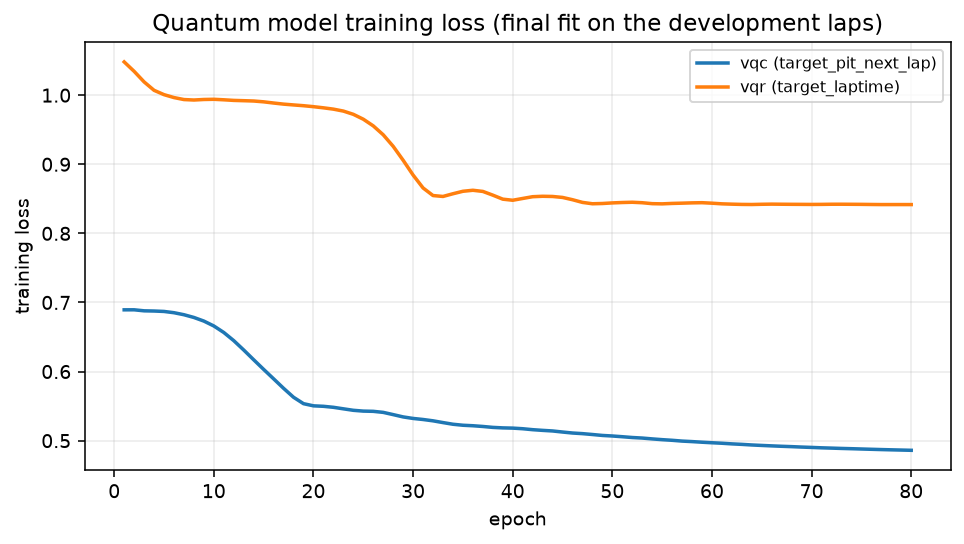

# Quantum Machine Learning — the part of this project you have to explain

This document assumes you know Python and classical machine learning, and that you have never
studied quantum computing. It builds from the qubit upwards, then explains exactly what our
circuits do, how they are trained, and what our results were.

Everything here matches the code in [`app/intelligence/qml/`](../app/intelligence/qml/) and the
artifacts in `artifacts/`. Every number is taken from the committed run
([`artifacts/metrics/qml_metrics.json`](../artifacts/metrics/qml_metrics.json)); none are invented.
Reading time is about 45 minutes.

**Contents**

1. [Why quantum ML here at all?](#1-why-quantum-ml-here-at-all)
2. [Quantum basics from zero](#2-quantum-basics-from-zero)
3. [The gates in our circuits](#3-the-gates-in-our-circuits)
4. [From F1 data to qubits](#4-from-f1-data-to-qubits)
5. [The variational circuit](#5-the-variational-circuit)
6. [Training](#6-training)
7. [The quantum kernel SVM](#7-the-quantum-kernel-svm)
8. [Classical vs quantum: reading our results](#8-classical-vs-quantum-reading-our-results)
9. [Limitations](#9-limitations)
10. [How to run it](#10-how-to-run-it)
11. [Viva prep: 15 questions](#11-viva-prep-15-questions)
12. [Glossary](#12-glossary)

---

## 1. Why quantum ML here at all?

### The honest motivation

The project is called *Quantum Optimization for F1 Race Strategy*, so a quantum component belongs
in it. But that is a naming reason, not a scientific one. The real reasons to build this module are:

**It is a fair, controlled experiment.** We already have a feature matrix, a chronological split and
a metric suite from Task 6. Dropping a new model family into that harness costs little and tells us
something: given the same laps and the same folds, how does a variational quantum circuit compare
with a classical model of the same size?

**Task 5 left us a small feature set.** The pit-decision target has 8 features. That is small enough
to compress into 4 qubits without the compression being absurd. Most datasets are not.

**Learning value.** Writing the circuit, the encoding and the training loop by hand teaches more
than reading about them. Every part of this module is about 100 lines of readable Python.

### What we are *not* claiming

Be very clear about this in a viva, because it is the first thing a good examiner will probe:

- **We are not claiming a quantum speed-up.** Our circuits run on `default.qubit`, PennyLane's
  *simulator*. A classical computer calculates every amplitude exactly. There is no quantum hardware
  anywhere in this project.
- **We are not claiming quantum models are better.** On our data they are competitive with
  classical models *of the same size* on one target and worse on the other. See §8.
- **We are not claiming these results generalise.** One race, 995 laps, one pit stop in the test set.
- **We are not claiming the simulation says anything about real devices.** Real qubits are noisy.
  Ours are perfect. §9 explains why that matters.

The only defensible claim is the narrow one: *on this data, with this encoding, a 14-parameter
quantum circuit performed like this compared with classical models given the same inputs.*

---

## 2. Quantum basics from zero

### 2.1 A bit versus a qubit

A classical bit is 0 or 1. Nothing else.

A **qubit** is described by two numbers, called **amplitudes**, one for outcome 0 and one for
outcome 1:

$$|\psi\rangle = a_0|0\rangle + a_1|1\rangle$$

The notation $|0\rangle$ (read "ket zero") is just a label for the state that always measures 0.
The amplitudes $a_0$ and $a_1$ are **complex numbers**. They obey one rule:

$$|a_0|^2 + |a_1|^2 = 1$$

That rule exists because $|a_0|^2$ is the **probability** of measuring 0, and $|a_1|^2$ the
probability of measuring 1. Probabilities must sum to 1.

So a qubit is a *probability distribution over two outcomes*, stored as two complex numbers. The
complex part is what makes it more than a coin flip — amplitudes can cancel each other out, which
probabilities cannot.

### 2.2 Superposition, with a real number

**Superposition** is the ordinary situation where both amplitudes are non-zero. It is not "the qubit
is 0 and 1 at once"; it is "the qubit is described by two amplitudes, and measuring it yields 0 or 1
with probabilities set by them".

Here is a real example, computed with the same library our circuits use. Start in $|0\rangle$ and
apply an $R_X$ rotation by $\pi/3$ (this gate is defined in §3):

```
RX(pi/3)|0> amplitudes: [0.866+0.j, 0.-0.5j]
  |a0|^2 = 0.7500   |a1|^2 = 0.2500   sum = 1.0000
```

So $a_0 = 0.866$ and $a_1 = -0.5i$. Measuring this qubit gives 0 with probability $0.75$ and 1 with
probability $0.25$. The qubit is in superposition. Note $a_1$ is imaginary — that phase carries no
information on its own here, but it does once gates combine states.

### 2.3 The Bloch sphere

Two complex numbers with one constraint leaves two free real parameters. That means every
single-qubit state can be drawn as a point on the surface of a sphere, called the **Bloch sphere**:

$$|\psi\rangle = \cos\!\left(\frac{\theta}{2}\right)|0\rangle + e^{i\phi}\sin\!\left(\frac{\theta}{2}\right)|1\rangle$$

- $\theta$ is the angle from the north pole. North pole ($\theta = 0$) is $|0\rangle$; south pole
  ($\theta = \pi$) is $|1\rangle$.
- $\phi$ is the angle around the equator — the **phase**.
- Every point on the surface is a valid qubit state. Points on the equator are equal superpositions.

Our $R_X(\pi/3)$ example sits at $\theta = \pi/3$ from the north pole: mostly $|0\rangle$, tilted
towards $|1\rangle$. A gate is a rotation of this sphere. That is the whole intuition for §3.

### 2.4 Measurement and expectation values

Measuring a qubit gives a single bit: 0 or 1. It also destroys the superposition. If you want the
*probabilities*, you must prepare and measure the same state many times.

Instead of raw outcomes, quantum ML usually reads out an **expectation value**. Assign the value
$+1$ to outcome 0 and $-1$ to outcome 1, and average:

$$\langle Z \rangle = (+1)\cdot P(0) + (-1)\cdot P(1) = |a_0|^2 - |a_1|^2$$

$Z$ here is the Pauli-Z **observable**, whose matrix is $\begin{pmatrix}1 & 0\\ 0 & -1\end{pmatrix}$.

For our example:

$$\langle Z \rangle = 0.75 - 0.25 = 0.5$$

and PennyLane confirms it:

```
<Z> = 0.5000   (cos(pi/3) = 0.5000)
```

That $\cos$ is not a coincidence: for $R_X(\theta)|0\rangle$, $\langle Z\rangle = \cos\theta$ exactly.

**This single number is our model's output.** It is a real number in $[-1, 1]$, it is differentiable
with respect to the gate angles, and it behaves like the last neuron of a neural network. Everything
after §5 builds on that.

A simulator computes $\langle Z \rangle$ exactly from the amplitudes. Real hardware must estimate it
by repeated measurement ("shots"), which introduces sampling error. We use the exact path.

### 2.5 Several qubits, and why $2^n$

One qubit needs 2 amplitudes. Two qubits need 4, one for each outcome $00, 01, 10, 11$:

$$|\psi\rangle = a_{00}|00\rangle + a_{01}|01\rangle + a_{10}|10\rangle + a_{11}|11\rangle$$

In general $n$ qubits need $2^n$ amplitudes, because there are $2^n$ possible measurement outcomes
and each needs its own amplitude. This is the cost that makes simulating large quantum systems hard:
the numbers you must track double with every qubit added.

Our circuits use 4 qubits, so our state has $2^4 = 16$ amplitudes. Checked on our actual trained
circuit:

```
our 4-qubit state has 16 amplitudes (2^4); first 4:
  [-0.053+0.0542j,  0.4328+0.4406j, -0.0551+0.0497j,  0.049+0.0415j]
  probabilities sum to 1.000000
```

16 complex numbers is nothing for a laptop. That is exactly why our experiment runs in under 30 seconds
— and exactly why it proves nothing about quantum advantage (§9).

### 2.6 Entanglement

A two-qubit state is **product** (unentangled) if you can write it as one qubit's state times
another's. If you cannot, it is **entangled**.

The standard example is the Bell state, made with a Hadamard and a CNOT:

```
Bell state probabilities [00, 01, 10, 11]: [0.5, 0., 0., 0.5]
```

Read that carefully. The outcome is $00$ half the time and $11$ half the time, and $01$ or $10$
**never**. So the two qubits always agree — measuring the first tells you the second with certainty,
even though each qubit alone is a perfect 50/50 coin.

No pair of independent single-qubit states can do this. Try: if qubit 1 is 50/50 and qubit 2 is
50/50 independently, then $P(01) = 0.25 \ne 0$. The correlation cannot be factorised.

**Why we care:** entanglement is what lets a circuit model *interactions between features*. Without
entangling gates, a circuit with one rotation per qubit is just $n$ separate one-feature models
added up — no more expressive than a linear model on those features. The CNOT ring in our circuit
(§5) is what makes it more than that.

---

## 3. The gates in our circuits

A gate is a matrix that multiplies the state vector. Gates must be **unitary** ($U^\dagger U = I$),
which is the mathematical way of saying they preserve total probability — the amplitudes still sum
to 1 after the gate. Every unitary is reversible, so there is no "erase" or "ReLU" in a circuit.

Our circuits use exactly four kinds of gate.

### 3.1 $R_X(\theta)$ — rotate about the X axis

$$R_X(\theta) = \begin{pmatrix} \cos\frac{\theta}{2} & -i\sin\frac{\theta}{2} \\[4pt] -i\sin\frac{\theta}{2} & \cos\frac{\theta}{2}\end{pmatrix}$$

*Intuition:* tips the Bloch-sphere point away from the north pole, through the Y-Z plane. It moves
probability from $|0\rangle$ to $|1\rangle$ as $\theta$ grows.

**This is the gate that loads our data.** PennyLane's `AngleEmbedding` defaults to `rotation="X"`,
and we use that default — so each feature becomes one $R_X$ angle. Worth memorising, because most
tutorials write $R_Y$ and an examiner may ask which you used.

### 3.2 $R_Y(\theta)$ — rotate about the Y axis

$$R_Y(\theta) = \begin{pmatrix} \cos\frac{\theta}{2} & -\sin\frac{\theta}{2} \\[4pt] \sin\frac{\theta}{2} & \cos\frac{\theta}{2}\end{pmatrix}$$

*Intuition:* the same tilt, but through the X-Z plane, and with only real entries. $R_Y$ is the gate
we use in the parameter-shift derivation in §6.3, because its real matrix keeps the algebra short.

### 3.3 $R_Z(\theta)$ — rotate about the Z axis

$$R_Z(\theta) = \begin{pmatrix} e^{-i\theta/2} & 0 \\ 0 & e^{i\theta/2}\end{pmatrix}$$

*Intuition:* spins the point around the vertical axis. It changes the **phase** only, so on its own
it never changes measurement probabilities in the Z basis. It matters when combined with other
rotations.

### 3.4 `Rot`$(\phi, \theta, \omega)$ — a general single-qubit rotation

$$\text{Rot}(\phi, \theta, \omega) = R_Z(\omega)\,R_Y(\theta)\,R_Z(\phi)$$

*Intuition:* three angles can reach **any** point on the Bloch sphere from any other. This is the
most general single-qubit gate, and it is what carries our trainable weights: each qubit gets one
`Rot` per layer, so 3 trainable angles per qubit per layer.

### 3.5 CNOT — controlled NOT

$$\text{CNOT} = \begin{pmatrix} 1&0&0&0 \\ 0&1&0&0 \\ 0&0&0&1 \\ 0&0&1&0 \end{pmatrix}$$

*Intuition:* two qubits — a **control** and a **target**. If the control is $|1\rangle$, flip the
target; otherwise do nothing. Applied to a superposed control, it produces entanglement, which is
how the Bell state in §2.6 was made.

**This is the only two-qubit gate in our circuits**, and it is what couples the features together.

---

## 4. From F1 data to qubits

Our feature matrix has 8 columns for the pit decision and 45 for lap time. Our circuit has 4 qubits
and one angle per qubit. Three steps close that gap. All three are implemented in
[`app/intelligence/qml/data.py`](../app/intelligence/qml/data.py), in the `AngleEncoder` class.

### 4.1 Step 1 — standardise (on training rows only)

Subtract the mean and divide by the standard deviation of each column, using **training rows only**.
Fitting on all rows would leak information about the test laps into training through the transform.

### 4.2 Step 2 — PCA down to 4 components

Principal Component Analysis finds the directions of greatest variance and keeps the first 4. Again
it is fitted on training rows only — inside each cross-validation fold, and on the development set
for the final model.

How much survives, from our committed run:

| Target | Features in | PCA output | Variance retained |
|---|---:|---:|---|
| `target_pit_next_lap` | 8 | 4 | **81.8%** |
| `target_laptime` | 45 | 4 | **28.7%** |

That second row is the single most important caveat in this whole document. Compressing 45 features
into 4 numbers throws away 71% of the variance **before the quantum model sees anything**. When the
lap-time circuit underperforms in §8, this is the first suspect — not the circuit.

### 4.3 Step 3 — map to $[0, \pi]$

Angles wrap around. $R_X(\theta)$ and $R_X(\theta + 2\pi)$ are the same gate, so a feature value of
$0.1$ and one of $6.38$ would be encoded identically. To prevent that, we squeeze each component
into $[0, \pi]$ with a min-max scaler fitted on training rows.

Test rows can still fall outside the training range. Those are **clipped** and counted — the
committed run clipped **24 values** for the pit target and **31** for lap time, out of
$180 \times 4 = 720$ test values each. The count is reported in `qml_metrics.json` rather than
hidden, because a clipped value means the model is being asked about a race state it never saw.

### 4.4 One real lap, all the way through

Here is **test row 177** of the pit-decision holdout: ZHO, Alfa Romeo, SOFT tyres, lap 54, stint 3.
This is the one lap in the entire test set where a driver actually pitted — the same lap Task 8
explains.

**Raw features (what Task 5 exported):**

| Feature | Value |
|---|---:|
| `tyre_life` | 25.0000 |
| `tracktemp_dev_x_tyrelife` | −27.7322 |
| `form_vs_baseline` | −0.0014 |
| `field_median_lag1` | 97.7780 |
| `field_pace_trend` | 0.1890 |
| `tyrelife_x_soft` | 25.0000 |
| `gap_roll3_mean` | 0.9977 |
| `compound_soft` | 1.0000 |

**Step 1 — standardise** using the 815 development laps' own mean and standard deviation:

$$z_{\text{tyre\_life}} = \frac{25.000 - 8.685}{4.714} = 3.4613$$

The full vector:

$$z = [3.4613,\; -5.4693,\; -0.1135,\; -0.9425,\; 0.1767,\; 4.0631,\; 0.6787,\; 1.2469]$$

Those first two numbers are already interesting: 3.46 and −5.47 standard deviations from the mean.
This lap is unusual, which is what Task 8 found too.

**Step 2 — PCA to 4 components:**

$$p = [0.5929,\; -1.8255,\; -4.1021,\; 4.7769]$$

**Step 3 — map to $[0, \pi]$.** The min-max scaler's training range for the 4th component was
$[-3.9967,\; 3.6115]$. Our value is $4.7769$, which is **above** that range, so it maps past $\pi$
and is clipped:

$$x = [1.6610,\; 1.1838,\; 0.3291,\; 3.1416]$$

That last value is exactly $\pi$ — one of the 24 clipped values. The circuit is being asked about a
lap more extreme than anything in training, and it can only see the edge of its range.

**These four numbers are the rotation angles.** The circuit applies
$R_X(1.6610)$ to qubit 0, $R_X(1.1838)$ to qubit 1, $R_X(0.3291)$ to qubit 2 and $R_X(3.1416)$ to
qubit 3. That is `AngleEmbedding`: one feature, one qubit, one rotation angle.

We finish this example in §5.3.

---

## 5. The variational circuit

### 5.1 The picture



*(`artifacts/figures/qml_circuit.png`, drawn by `qml.draw_mpl` from the same function that trains —
so it cannot drift from the code.)*

Read it left to right; each horizontal line is a qubit:

1. **`RX(...)`** — the four data angles from §4.4 (shown here with example values).
2. **`Rot(φ, θ, ω)`** — one general rotation per qubit, carrying the trainable weights.
3. **The CNOT ring** — qubit 0 controls 1, 1 controls 2, 2 controls 3, and 3 controls 0. This closes
   the loop so every qubit can influence every other.
4. **The meter symbol** — measure $\langle Z \rangle$ on qubit 0 only.

### 5.2 What `StronglyEntanglingLayers` does

It is the block labelled steps 2 and 3, repeated `n_layers` times. Per layer it applies:

- one `Rot`$(\phi, \theta, \omega)$ to each qubit — 3 trainable angles each;
- a ring of CNOTs connecting the qubits.

So the weight tensor has shape `(n_layers, n_qubits, 3)`. For our selected model
(`n_layers = 1`, `n_qubits = 4`) that is $1 \times 4 \times 3 = 12$ angles.

`BasicEntanglerLayers` is the simpler alternative: one $R_X$ per qubit instead of a full `Rot`, so
one angle per qubit per layer instead of three. We used `StronglyEntanglingLayers` because the extra
angles cost nothing at this scale and give each qubit full freedom on the Bloch sphere.

**Why layers at all?** One layer entangles neighbours once. Stacking layers lets information travel
further and builds more complex functions — the same reason deep networks stack layers. Our search
tried 1, 2 and 3 layers (§6.5); 1 won, which is what you would expect with 815 training rows.

Here are the actual trained weights of our classifier, from
`artifacts/models/qml/vqc_weights.npy`, shape `(1, 4, 3)`:

```
[[[ 0.0305 -0.1040  0.0750]     <- qubit 0: phi, theta, omega
  [-1.6022 -1.1790 -0.1302]     <- qubit 1
  [ 1.5929 -0.9465 -0.0017]     <- qubit 2
  [ 1.6478  0.6302  0.0778]]]   <- qubit 3
```

Notice qubit 0's angles stayed near their small random initialisation while qubits 1–3 moved to
roughly $\pm 1.6$ radians. Qubit 0 is the one we measure; the others shape what reaches it.

### 5.3 From $\langle Z \rangle$ to an answer

The circuit gives one number in $[-1, 1]$. Two trainable numbers turn it into a prediction.

**Classifier (VQC).** A **sigmoid** with a trainable scale $s$ and bias $b$:

$$P(\text{pit}) = \sigma\big(s \cdot \langle Z \rangle + b\big), \qquad \sigma(u) = \frac{1}{1 + e^{-u}}$$

Without $s$ and $b$ the probability could never leave $\sigma([-1,1]) = [0.27, 0.73]$, which cannot
express confidence. Our trained values are $s = 6.3002$ and $b = -3.5509$
(`artifacts/models/qml/vqc_config.json`).

**Finishing the worked example.** Feeding our ZHO lap-54 angles through the trained circuit:

$$\langle Z \rangle = 0.4686$$
$$P(\text{pit}) = \sigma(6.3002 \times 0.4686 - 3.5509) = \sigma(-0.5987) = 0.3546$$

The tuned decision threshold is $0.6519$ (§6.6), so the model says **stay out**. The driver pitted.
Our model missed it — the same miss Task 8 documents for the deep network, on the same lap.

**Regressor (VQR).** Same circuit, different head — a straight line instead of a sigmoid:

$$\hat{y}_{\text{std}} = s \cdot \langle Z \rangle + b$$

This predicts a **standardised** lap time. Because $\langle Z \rangle \in [-1, 1]$, the circuit could
never output "97.5 seconds" directly. So the target is standardised on development rows only
(mean $99.3704$ s, sd $2.0465$ s) and every prediction is converted back before any metric:

$$\hat{y}_{\text{seconds}} = \hat{y}_{\text{std}} \times 2.0465 + 99.3704$$

Trained values: $s = 1.6100$, $b = -0.3741$. Note the reachable range is
$99.3704 \pm 2.0465 \times 1.6100 \approx [96.08,\ 102.66]$ s — the circuit **cannot** predict
outside that window. Our slowest test laps are near 104 s, so those are out of reach by
construction. That is a real limitation of this head, and it shows up in the results.

**Parameter count.** $12$ circuit angles $+\ s + b = \mathbf{14}$ trainable parameters, for both the
classifier and the regressor. Remember that number; §8 turns on it.

---

## 6. Training

### 6.1 The hybrid loop

Nothing about training is quantum. The loop is the one you already know:

1. **Quantum step:** run the circuit for every training row, get $\langle Z \rangle$ per row.
2. **Classical step:** apply the head ($\sigma$ or a line), compute the loss.
3. **Gradient step:** get $\partial \text{loss} / \partial \theta$ for every angle.
4. **Update:** Adam adjusts the angles. Repeat.

This is called a **hybrid quantum-classical** algorithm: the circuit evaluates a function, and an
ordinary classical optimiser decides what to do next. The angles live in classical memory the whole
time.

We train **full-batch** (all 815 rows per step), because PennyLane broadcasts the whole batch
through the simulator in one call — a full-batch gradient takes about 8 ms, so mini-batching would
add noise and code for no speed gain.

### 6.2 The loss functions

**Classifier — class-weighted binary cross-entropy:**

$$\mathcal{L} = -\frac{1}{N}\sum_{i=1}^{N} \Big[ w_+ \, y_i \log p_i + w_- (1 - y_i)\log(1 - p_i) \Big]$$

**Regressor — mean squared error** on the standardised target:

$$\mathcal{L} = \frac{1}{N}\sum_{i=1}^{N} (\hat{y}_i - y_i)^2$$

### 6.3 The parameter-shift rule

Here is the part examiners like, because it is where quantum gradients differ from ordinary
backpropagation.

**The problem.** In a neural network you compute gradients by backpropagation — you store every
intermediate activation and walk backwards. On real quantum hardware you *cannot*: measuring the
intermediate state destroys it. You need gradients from circuit **evaluations only**.

**The good news.** For rotation gates there is an exact formula. Not a finite-difference
approximation — exact.

**Derivation for a single $R_Y$ gate.** Take the simplest circuit: start in $|0\rangle$, apply
$R_Y(\theta)$, measure $\langle Z \rangle$. Call the result $f(\theta)$.

Step 1 — write the state:

$$R_Y(\theta)|0\rangle = \cos\!\left(\frac{\theta}{2}\right)|0\rangle + \sin\!\left(\frac{\theta}{2}\right)|1\rangle$$

Step 2 — compute the expectation value, using $\langle Z\rangle = |a_0|^2 - |a_1|^2$:

$$f(\theta) = \cos^2\!\left(\frac{\theta}{2}\right) - \sin^2\!\left(\frac{\theta}{2}\right) = \cos\theta$$

(the last step is the double-angle identity).

Step 3 — differentiate:

$$\frac{df}{d\theta} = -\sin\theta$$

Step 4 — now the trick. Evaluate $f$ at two *shifted* angles:

$$\frac{f(\theta + \frac{\pi}{2}) - f(\theta - \frac{\pi}{2})}{2} = \frac{\cos(\theta + \frac{\pi}{2}) - \cos(\theta - \frac{\pi}{2})}{2} = \frac{-\sin\theta - \sin\theta}{2} = -\sin\theta$$

The two sides are equal. So:

$$\boxed{\;\frac{df}{d\theta} = \frac{f\!\left(\theta + \frac{\pi}{2}\right) - f\!\left(\theta - \frac{\pi}{2}\right)}{2}\;}$$

**Read what that says.** To get an exact derivative, run the *same circuit* twice with the angle
shifted by $\pm\pi/2$ and subtract. No intermediate states, no backpropagation — just two more
circuit runs. This works for any gate of the form $e^{-i\theta P/2}$ with $P^2 = I$, which covers
$R_X$, $R_Y$, $R_Z$ and each of `Rot`'s three angles.

**Checked on our own code**, both for the textbook case and for a real weight in our trained
classifier:

```
RY: autograd grad -0.644218 | parameter shift -0.644218 | -sin(0.7) = -0.644218
our circuit, weight[0,1,0]: autograd 0.017689 | parameter shift 0.017689
```

Identical to six decimals. The cost is $2$ circuit evaluations per parameter, so our 12 angles need
24 evaluations per gradient step.

**One honest detail:** on a *simulator*, PennyLane's autograd interface can differentiate straight
through the simulation (backpropagation), which is faster, and that is what our training actually
uses. The parameter-shift rule is what you would need on hardware, and it gives the same answer —
as the check above shows.

### 6.4 Adam

Plain gradient descent applies the same step size to every parameter. **Adam** keeps a running
average of each parameter's gradient (momentum) and of its squared gradient, then scales each step
by them. Parameters with small, consistent gradients take bigger steps; noisy ones take smaller.

We use `qml.AdamOptimizer(stepsize=lr)` with the learning rate chosen by the search below. Training
loss from our committed run (`artifacts/models/qml/*_config.json`):

| Model | Epochs | Loss at epoch 1 | Loss at epoch 80 |
|---|---:|---:|---:|
| VQC (weighted BCE) | 80 | 0.6893 | **0.4860** |
| VQR (MSE, standardised) | 80 | 1.0481 | **0.8417** |



*(`artifacts/figures/qml_training_loss.png`.)* Both curves fall and flatten — the optimiser is
working, and more epochs would not obviously help. The VQR's MSE of 0.84 on a standardised target is
worth reading carefully: predicting the mean every time would give an MSE of about 1.0, so the
circuit explains only a little of the variance. §8 confirms that.

### 6.5 Class weighting

Pit events are 4.8% of laps. An unweighted loss is minimised by predicting "no pit" forever, which
scores 95% accuracy and is useless.

So each class is weighted by $w_c = \dfrac{N}{2 N_c}$. On our 815 development laps that gives:

$$w_- = 0.5306 \qquad w_+ = 8.6702$$

A missed pit stop costs about **16 times** more than a false alarm during training. This is the same
correction Task 7 applies, for the same reason.

### 6.6 What we tuned, and where

Two knobs, chosen on the **cross-validation folds only** — never on the test laps:

- layers $\in \{1, 2, 3\}$
- learning rate $\in \{0.05, 0.1\}$

All six combinations, scored on 4 expanding-window folds (from `qml_metrics.json`):

| Layers | LR | VQC — CV PR-AUC | VQR — CV MAE (s) |
|---:|---:|---|---|
| 1 | 0.05 | 0.1928 ± 0.1908 | 1.9115 ± 0.4290 |
| **1** | **0.10** | **0.3037 ± 0.1912** ← chosen | **1.7459 ± 0.3706** ← chosen |
| 2 | 0.05 | 0.1893 ± 0.1615 | 1.9046 ± 0.6088 |
| 2 | 0.10 | 0.2447 ± 0.1744 | 1.8673 ± 0.5694 |
| 3 | 0.05 | 0.2483 ± 0.2085 | 1.7642 ± 0.3772 |
| 3 | 0.10 | 0.2588 ± 0.2245 | 1.7837 ± 0.5116 |

Both targets picked 1 layer at learning rate 0.1. **Look at the ± columns before reading anything
into the winner**: the spreads are larger than the gaps between configurations, so this search
narrowed the field, it did not prove one setting is best.

**The decision threshold** is tuned separately, on pooled out-of-fold predictions (635 predictions
containing 36 pit laps), exactly as Tasks 6 and 7 do. For the VQC it moved from the default 0.5 to
**0.6519**, which raised out-of-fold F1 from 0.1552 to **0.3146**.

---

## 7. The quantum kernel SVM

This is our second quantum model, and it works on a completely different principle. Nothing in the
circuit is trained at all.

### 7.1 Kernels, in one paragraph

A support vector machine only ever needs to know **how similar two data points are**. That
similarity function is the *kernel* $K(a, b)$. Swap in a different kernel and the SVM draws a
different boundary. The idea here: use a quantum circuit as the similarity function.

### 7.2 The fidelity kernel

Encode each lap into a quantum state, $a \mapsto |\phi(a)\rangle$. Then define similarity as the
overlap between the two states:

$$K(a, b) = \big|\langle \phi(b) | \phi(a) \rangle\big|^2$$

This is called **fidelity**. It is 1 when the two states are identical and 0 when they are
perfectly distinguishable.

**How we compute it** ([`kernel_svm.py`](../app/intelligence/qml/kernel_svm.py)): apply the feature
map for $a$, then the *inverse* feature map for $b$, and measure the probability of getting all
zeros:

$$K(a,b) = P(\text{measure } 0000)$$

If $a = b$ the two operations cancel exactly and you are back in $|0000\rangle$, so the probability
is 1. The more the states differ, the less cancels.

Our feature map is `AngleEmbedding` plus a ring of CZ gates, repeated **2 times**. The entanglers
matter: without them the fidelity factorises into independent per-qubit terms and the kernel
collapses into something a classical cosine kernel could produce.

Real kernel values for the first three development laps:

```
[[1.0000  0.9868  0.8823]
 [0.9868  1.0000  0.9409]
 [0.8823  0.9409  1.0000]]
```

The diagonal is exactly 1 (each lap is identical to itself), the matrix is symmetric, and laps 1 and
2 are more alike (0.9868) than laps 1 and 3 (0.8823). These properties are asserted in
`tests/test_qml.py`.

### 7.3 How this differs from the variational approach

| | Variational (VQC) | Quantum kernel SVM |
|---|---|---|
| What is trained | the circuit's 12 angles | nothing in the circuit |
| Circuit's role | *is* the model | computes a similarity matrix |
| Classical part | the sigmoid head | the entire SVM |
| Optimisation | gradient descent, can get stuck | convex — one global optimum |
| Cost | $O(N)$ circuit runs per epoch | $O(N^2)$ circuit runs, once |

That $O(N^2)$ is the catch: 815 development laps means 664,225 pairs. On 4 qubits with broadcasting
that took **under 4 seconds**, so we did not need to subsample. On a bigger dataset it would dominate.

The SVM fitted **412 support vectors**, and we report its parameter count as 413 (dual coefficients
plus intercept). That number is *not* comparable to the circuit's 14 trainable angles — different
kind of parameter entirely, and the report says so.

---

## 8. Classical vs quantum: reading our results

Full report: [`artifacts/reports/classical_vs_quantum_report.md`](../artifacts/reports/classical_vs_quantum_report.md).

### 8.1 Why there are two classical baselines

"Quantum beats classical" is meaningless without saying *which* classical. We give two, and they
answer different questions.

**Baseline 1 — Task 6's selected model.** A random forest (pit) or SVR (lap time), using **all**
selected features. This answers: *is the quantum model competitive with what we already have?* It
is not a like-for-like comparison — the classical model sees 8 or 45 features while the circuit sees
4 compressed components.

**Baseline 2 — parameter-matched models on the same reduced inputs.** Logistic/linear regression (5
parameters) and a tiny MLP (13 parameters) trained on the **identical 4 PCA components** the circuit
sees. This is the fair fight: same information, comparable capacity, different model family.

Without baseline 2 we could not tell whether a bad quantum result meant "quantum is bad" or "we
threw away 71% of the variance". With it, we can.

### 8.2 The pit-decision table

| Model | Family | Params | Train (s) | CV PR-AUC (mean ± sd) | Test PR-AUC | Test ROC-AUC |
|---|---|---:|---:|---|---:|---:|
| vqc | quantum | 14 | 0.45 | **0.3037 ± 0.1912** | 0.0080 | 0.3073 |
| quantum_kernel_svm | quantum | 413 | 3.79 | 0.2127 ± 0.1940 | 0.0122 | 0.5475 |
| logistic_regression (reduced) | classical, matched | 5 | 0.00 | 0.2047 ± 0.1333 | 1.0000 | 1.0000 |
| tiny_mlp (reduced) | classical, matched | 13 | 0.02 | 0.1529 ± 0.0883 | 0.0137 | 0.7989 |
| random_forest — Task 6, all features | classical, full | — | — | 0.3863 ± 0.1249 | 0.2500 | 0.9832 |

*(Training times are wall clock on one laptop and vary by a few percent between runs; every
other number is deterministic and reproduces exactly.)*

**How to read it, in order:**

1. **Look at the CV column, not the test column.** The holdout contains **one** pit lap. A test
   PR-AUC of 1.0 means that single lap happened to get the top score; 0.008 means it did not. Those
   numbers measure luck, not skill. Logistic regression's perfect 1.0 is the clearest example — it
   is not a triumph, it is a coin landing heads.
2. **On the fair comparison, the VQC wins.** 0.3037 against 0.2047 (logistic regression) and 0.1529
   (tiny MLP), all on the same 4 components, with 14 parameters against 5 and 13.
3. **It still loses to Task 6.** The random forest reaches 0.3863 using all 8 features. Information
   beat model family.
4. **Check the error bars before believing any of it.** ±0.19 on the VQC and ±0.13 on logistic
   regression. Those intervals overlap heavily. The honest statement is "the VQC ranked highest
   among the matched models", not "the VQC is better".

### 8.3 The lap-time table

| Model | Family | Params | CV MAE (s) | Test MAE (s) | Test R² |
|---|---|---:|---|---:|---:|
| vqr | quantum | 14 | 1.7459 ± 0.3706 | 1.1044 | −0.4562 |
| linear_regression (reduced) | classical, matched | 5 | **1.6243 ± 0.3357** | 0.9459 | −0.1753 |
| tiny_mlp (reduced) | classical, matched | 13 | 1.7697 ± 0.2388 | 1.6813 | −1.3695 |
| svr — Task 6, all features | classical, full | — | **1.3813 ± 0.5584** | 0.7815 | 0.3023 |

Here the quantum model **loses** to a 5-parameter linear regression on the same inputs (1.7459
against 1.6243), and loses badly to Task 6's SVR on all features.

Two structural reasons, both ours rather than quantum computing's fault:

- **28.7% variance retained.** Four components cannot carry 45 features' worth of signal.
- **The output head is bounded.** As shown in §5.3, the trained VQR can only produce lap times in
  roughly $[96.08, 102.66]$ s. Laps outside that are unreachable no matter what the circuit does.

A negative R² means the model does worse than always predicting the mean. Three of the four models
here have one, on the same laps, so this is a hard split rather than a broken circuit.

### 8.4 Reading each figure

| Figure | What to look at |
|---|---|
| [`qml_circuit.png`](../artifacts/figures/qml_circuit.png) | The actual gates: 4 RX encodings, 4 trainable `Rot`s, the CNOT ring, one measurement. |
| [`qml_training_loss.png`](../artifacts/figures/qml_training_loss.png) | Both losses fall and flatten. Flat ≠ good — check the metrics too. |
| [`qml_metric_comparison.png`](../artifacts/figures/qml_metric_comparison.png) | Cross-validated scores with fold spread. Purple = quantum, blue = matched classical, amber = Task 6. **The error bars overlap** — that is the main message. |
| [`qml_training_time.png`](../artifacts/figures/qml_training_time.png) | Log scale. The circuits take ~0.4 s, classical models ~0.01 s. This compares simulation cost against fitting cost — it says nothing about hardware. |
| [`qml_roc_pr_vs_classical.png`](../artifacts/figures/qml_roc_pr_vs_classical.png) | ROC and PR curves on the test laps. With one positive lap these are step functions; treat them as illustrations. |
| [`qml_predicted_vs_actual.png`](../artifacts/figures/qml_predicted_vs_actual.png) | Lap-time predictions against truth. Points cluster in a narrow horizontal band — the bounded output head of §5.3, visible. |

---

## 9. Limitations

**Simulator, not hardware.** Every result comes from `default.qubit`, which computes all 16
amplitudes exactly with linear algebra. We have run a classical simulation of a quantum algorithm.
Nothing here required a quantum computer, and nothing here demonstrates that one would help.

**Noise and NISQ.** Today's devices are **NISQ** — Noisy Intermediate-Scale Quantum. Qubits lose
their state (decoherence) in microseconds, gates apply imperfectly, and measurements misreport.
Error correction needs far more qubits than exist. Our circuit is short and shallow, which is the
kind that survives best, but we have not tested it under noise and make no claim that it would work
on hardware.

**Barren plateaus.** As circuits get wider and deeper, gradients of random circuits shrink
exponentially with qubit count. The loss surface flattens and training stalls — the quantum version
of a vanishing gradient. Our 4-qubit, 1-layer circuit is far too small to hit this, but it is the
main obstacle to scaling the approach up, and it is why "just add more qubits" is not a plan.

**Small data.** 815 development laps, 180 test laps, **one** labelled pit stop in the test set. Our
test-set classification numbers are therefore decided by a single lap, which is why §8 keeps
redirecting you to the CV columns.

**Simulation cost.** Our whole experiment runs in under 30 seconds because $2^4 = 16$ amplitudes is tiny.
Simulation cost doubles per qubit: 30 qubits needs about a billion amplitudes and specialised
hardware. That cliff is why quantum ML research is stuck with small demonstrations — including this
one.

**Encoding loss.** 28.7% variance retained for lap time (§4.2). Much of what the circuit gets wrong
was thrown away before the circuit ran.

**No proven advantage.** There is no theoretical result saying a variational circuit should beat a
classical model on tabular data like ours. Our VQC's edge over the matched classical models on the
pit decision is interesting, within overlapping error bars, on one race. It is not evidence of
quantum advantage and we do not present it as such.

---

## 10. How to run it

```bash
source .venv/bin/activate
python scripts/run_qml.py                     # the whole experiment
```

It needs Task 5's feature contract and Task 6's committed metrics (for the classical reference), so
on a fresh clone run `python scripts/build_all.py` first.

As a pipeline stage:

```bash
python scripts/build_all.py                   # includes the quantum stage
python scripts/build_all.py --skip-qml        # skip it (also for machines without pennylane)
python scripts/build_all.py --force           # rebuild everything, quantum included
```

**Runtime: about 27 seconds** on a laptop CPU — six hyperparameter configurations across
four folds for two targets, plus the kernel matrix, plus the final fits, plus all figures. Seeded,
so repeating it reproduces the same numbers.

**Where the outputs land:**

| Path | Contents |
|---|---|
| `artifacts/models/qml/vqc_weights.npy`, `vqr_weights.npy` | trained circuit angles |
| `artifacts/models/qml/*_config.json` | hyperparameters, scale/bias, threshold, encoding details |
| `artifacts/models/qml/quantum_kernel_svc.joblib` + `_train_inputs.npy` | the fitted SVM and the vectors needed to rebuild its kernel |
| `artifacts/metrics/qml_metrics.json` | every trial, fold, threshold, metric and prediction |
| `artifacts/figures/qml_*.png` | the six figures of §8.4 |
| `artifacts/reports/classical_vs_quantum_report.md` | the comparison report |

Model weights sit under `artifacts/models/`, which the API does not serve. The dashboard's
**Models** page shows the results, reading only `qml_metrics.json` through `GET /api/qml/summary`.

Tests: `pytest tests/test_qml.py` (15 tests — encoding fitted on training rows only, angle clipping,
circuit output shapes, seed determinism, kernel validity, weights reloading identically).

---

## 11. Viva prep: 15 questions

**1. What is a qubit, in one sentence?**
A two-outcome system described by two complex amplitudes whose squared magnitudes give the
probabilities of measuring 0 or 1. Unlike a bit it can be in superposition, and unlike a random bit
its amplitudes can interfere. Our circuits use four of them.

**2. Why does the state need $2^n$ numbers?**
Because $n$ qubits have $2^n$ possible measurement outcomes, and each outcome needs its own
amplitude. Our 4 qubits need 16 complex numbers. This doubling is why simulating many qubits is hard
— and why our 4-qubit simulation is easy.

**3. Is your model running on a quantum computer?**
No. Everything runs on PennyLane's `default.qubit` simulator, which computes all 16 amplitudes
exactly using ordinary linear algebra. We have simulated a quantum algorithm on a laptop. We make no
hardware claims at all.

**4. How does an F1 lap become a quantum state?**
Three steps, all fitted on training rows only: standardise the features, compress to 4 components
with PCA, then map each component into $[0, \pi]$. Those four numbers become the angles of four
$R_X$ rotations, one per qubit — that is `AngleEmbedding`.

**5. Why map to $[0, \pi]$ specifically?**
Rotation angles wrap: $R_X(\theta)$ and $R_X(\theta + 2\pi)$ are the same gate, so unbounded
features would alias onto each other. $[0, \pi]$ is half a turn, which keeps the map injective.
Test values outside the training range are clipped and counted — 24 of 720 for the pit target.

**6. What exactly is trained?**
Twelve rotation angles inside `StronglyEntanglingLayers` (3 per qubit for 1 layer), plus a scale and
a bias in the classical output head: 14 parameters in total. The data-encoding rotations are fixed
by the data and the entangling CNOTs have no parameters.

**7. How do you get gradients out of a quantum circuit?**
By the parameter-shift rule: for a rotation gate, $\frac{df}{d\theta} = \frac{f(\theta + \pi/2) -
f(\theta - \pi/2)}{2}$, which is exact rather than a finite-difference approximation. It needs two
extra circuit evaluations per parameter and no intermediate states, so it works on hardware where
backpropagation cannot. On our simulator PennyLane backpropagates for speed; we verified both give
the same answer to six decimals.

**8. Why is there entanglement in the circuit at all?**
Without entangling gates, each qubit evolves independently, so the circuit is just four separate
one-feature functions combined at the end — about as expressive as a linear model. The CNOT ring
lets features interact, which is the only reason the circuit can represent anything a linear model
cannot.

**9. Why did you use a class-weighted loss?**
Pit events are 4.8% of laps, so an unweighted loss is minimised by never predicting a stop. We
weight each class by $N/(2N_c)$, giving $w_+ = 8.67$ against $w_- = 0.53$ — a missed stop costs
about 16 times a false alarm. Task 7 does the same thing for the same reason.

**10. Your test PR-AUC for logistic regression is 1.0. Did it solve the problem?**
No. The test laps contain exactly one pit event, so PR-AUC is 1.0 whenever that single lap gets the
highest score and near zero otherwise. Every test classification metric here is decided by one lap,
which is why we select and report on the cross-validated columns instead.

**11. Did the quantum model beat the classical one?**
On the pit decision, against models with a comparable number of parameters on identical inputs, yes:
CV PR-AUC 0.3037 against 0.2047 and 0.1529. On lap time, no: 1.7459 s MAE against 1.6243 s for a
linear model. Neither quantum model beats Task 6 using all the features, and all the fold spreads
overlap, so none of this separates the models conclusively.

**12. Why is your lap-time regressor so weak?**
Two reasons, both ours. PCA to 4 components keeps only 28.7% of the variance of the 45 lap-time
features, so most of the signal is gone before the circuit runs. And the trained output head can
only reach about 96.1–102.7 s, so slower laps are unreachable by construction.

**13. What is a barren plateau and does it affect you?**
As random circuits get wider and deeper, their gradients shrink exponentially with the number of
qubits, so the loss surface flattens and training stalls. Our 4-qubit, single-layer circuit is far
too small to suffer from it. It is the main reason scaling this approach up is hard.

**14. How is the quantum kernel SVM different from the VQC?**
The VQC trains the circuit's angles by gradient descent. The kernel SVM trains nothing in the
circuit: it uses the circuit only to compute fidelity $|\langle\phi(b)|\phi(a)\rangle|^2$ between
pairs of laps, then hands that matrix to a classical SVM. It is convex so it has one global optimum,
but it costs $O(N^2)$ circuit evaluations — 664,225 pairs for our 815 development laps, which took about 4 seconds.

**15. If it is all simulated and it does not win, why keep it?**
Because the experiment is honest and it is set up correctly: same data, same splits, same metric
code, fair baselines, and results reported whichever way they fall. It shows we can implement a
variational circuit, encode real data into it, train it with a gradient rule that works on hardware,
and compare it without overclaiming. That is the skill being examined — not a quantum win.

---

## 12. Glossary

| Term | Meaning |
|---|---|
| **Amplitude** | A complex number attached to one measurement outcome. Its squared magnitude is that outcome's probability. |
| **AngleEmbedding** | PennyLane template that encodes one feature per qubit as a rotation angle. Defaults to $R_X$, which is what we use. |
| **Ansatz** | The fixed structure of a variational circuit — which gates, in which order — before its angles are trained. Ours is `StronglyEntanglingLayers`. |
| **Barren plateau** | A region where gradients vanish exponentially with qubit count, stalling training. Affects wide, deep circuits; not ours. |
| **BasicEntanglerLayers** | A lighter ansatz: one rotation per qubit per layer instead of three. We chose the stronger one. |
| **Bloch sphere** | A sphere whose surface points are all possible single-qubit states. Gates are rotations of it. |
| **CNOT** | Two-qubit gate: flips the target qubit if the control is $\vert 1\rangle$. Our only entangling gate. |
| **Decoherence** | Loss of quantum state through interaction with the environment. The core problem in real hardware; absent from our simulator. |
| **default.qubit** | PennyLane's exact state-vector simulator. Every result in this project comes from it. |
| **Entanglement** | A multi-qubit state that cannot be written as separate single-qubit states. What lets a circuit model feature interactions. |
| **Expectation value** | The average of an observable over many measurements. Our readout is $\langle Z\rangle = P(0) - P(1) \in [-1, 1]$. |
| **Fidelity** | Overlap between two quantum states, $\vert\langle\phi\vert\psi\rangle\vert^2$. Our kernel SVM uses it as a similarity measure. |
| **Hybrid quantum-classical** | An algorithm where a circuit computes a value and a classical optimiser updates its parameters. All our training is this. |
| **NISQ** | Noisy Intermediate-Scale Quantum — today's devices: tens to hundreds of noisy qubits, no error correction. |
| **Observable** | A measurable quantity, written as a matrix. We measure Pauli-Z on qubit 0. |
| **Parameter-shift rule** | Exact gradient of a circuit from two shifted evaluations: $[f(\theta + \pi/2) - f(\theta - \pi/2)]/2$. Works on hardware. |
| **Pauli-Z** | The observable $\mathrm{diag}(1, -1)$. Gives $+1$ for outcome 0 and $-1$ for outcome 1. |
| **Qubit** | The quantum unit of information: two complex amplitudes, one constraint, two possible measurement outcomes. |
| **Rot$(\phi,\theta,\omega)$** | The most general single-qubit gate, $R_Z(\omega)R_Y(\theta)R_Z(\phi)$. Carries our trainable weights. |
| **$R_X$, $R_Y$, $R_Z$** | Rotations about the X, Y and Z axes of the Bloch sphere, each by one angle. |
| **Shots** | Repeated circuit executions used to estimate probabilities on hardware. We use exact simulation instead, so shot noise is absent. |
| **StronglyEntanglingLayers** | Our ansatz: a `Rot` on every qubit, then a CNOT ring, repeated per layer. |
| **Superposition** | A state with more than one non-zero amplitude. Not "both at once" — a distribution with interference. |
| **Unitary** | A reversible, probability-preserving matrix. Every quantum gate is one. |
| **Variational circuit** | A circuit with trainable gate angles, optimised against a loss — the quantum analogue of a small neural network. Also called a VQC or VQR depending on the task. |
