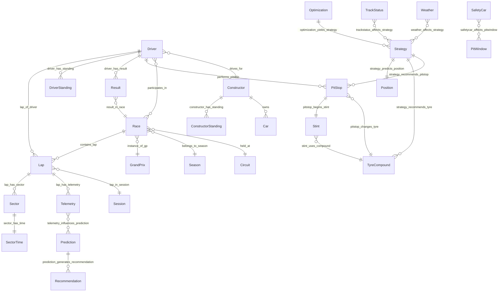

# Entity-Relationship Diagram

Generated from f1kr.schema. Rendered by GitHub / Mermaid Live.

```mermaid
erDiagram
    Driver }o--|| Constructor : "drives_for"
    Constructor ||--o{ Car : "owns"
    Driver }o--o{ Race : "participates_in"
    Race }o--|| Circuit : "held_at"
    Race }o--|| Season : "belongs_to_season"
    Race }o--|| GrandPrix : "instance_of_gp"
    Race ||--o{ Lap : "contains_lap"
    Lap }o--|| Driver : "lap_of_driver"
    Lap }o--|| Session : "lap_in_session"
    Lap ||--o{ Telemetry : "lap_has_telemetry"
    Lap ||--o{ Sector : "lap_has_sector"
    Sector ||--|| SectorTime : "sector_has_time"
    Driver ||--o{ PitStop : "performs_pitstop"
    PitStop }o--|| TyreCompound : "pitstop_changes_tyre"
    PitStop ||--|| Stint : "pitstop_begins_stint"
    Stint }o--|| TyreCompound : "stint_uses_compound"
    Weather }o--o{ Strategy : "weather_affects_strategy"
    SafetyCar }o--o{ PitWindow : "safetycar_affects_pitwindow"
    TrackStatus }o--o{ Strategy : "trackstatus_affects_strategy"
    Telemetry }o--o{ Prediction : "telemetry_influences_prediction"
    Strategy ||--o{ PitStop : "strategy_recommends_pitstop"
    Strategy ||--o{ TyreCompound : "strategy_recommends_tyre"
    Strategy ||--|| Position : "strategy_predicts_position"
    Prediction ||--o{ Recommendation : "prediction_generates_recommendation"
    Driver ||--o{ Result : "driver_has_result"
    Result }o--|| Race : "result_in_race"
    Driver ||--o{ DriverStanding : "driver_has_standing"
    Constructor ||--o{ ConstructorStanding : "constructor_has_standing"
    Optimization ||--o{ Strategy : "optimization_yields_strategy"
```
