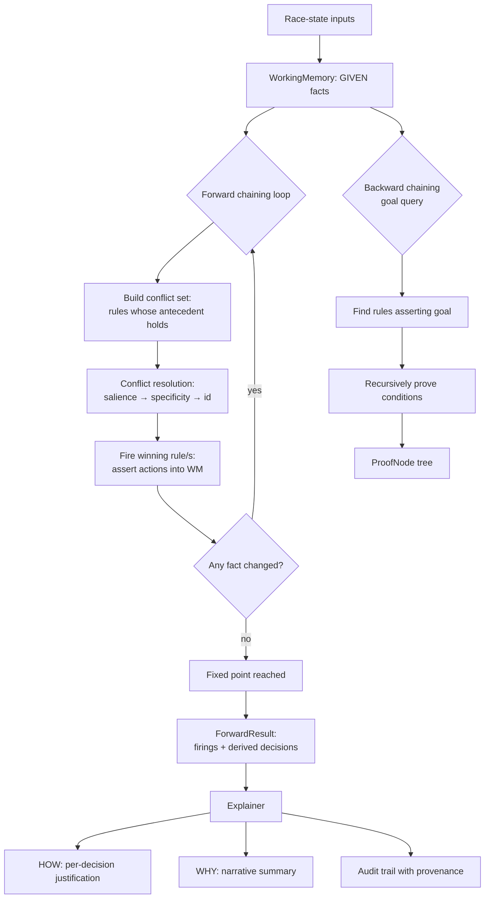
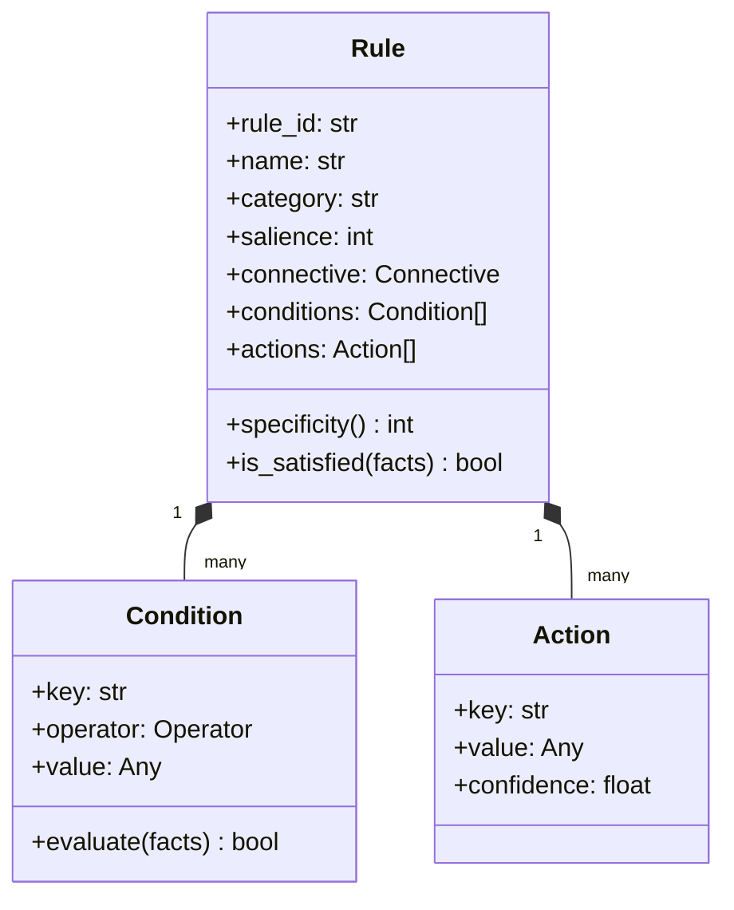

# Expert System Architecture

## Inference control flow

## Rule anatomy

## Conflict-resolution semantics

When multiple rules are satisfied simultaneously, the conflict set is ordered by
the active strategy:

| Strategy | Primary | Secondary | Tie-break |
|----------|---------|-----------|-----------|
| `SALIENCE` (default) | higher salience | higher specificity | rule-id |
| `SPECIFICITY` | higher specificity | higher salience | rule-id |
| `FIFO` | declaration order | — | — |

Salience bands encode strategic priority so that, e.g., a weather-critical
override (salience 100) always precedes a generic tyre-selection rule
(salience 40), guaranteeing that safety-relevant conclusions dominate.

## Termination guarantee

Forward chaining terminates because:

1. Each rule firing either changes working memory or is skipped.
2. A per-rule *firing signature* (rule-id + asserted key/value pairs) is
   recorded; a rule cannot re-assert an identical conclusion.
3. The loop halts as soon as an iteration changes nothing (fixed point), and a
   `max_iterations` cap bounds pathological cases.
